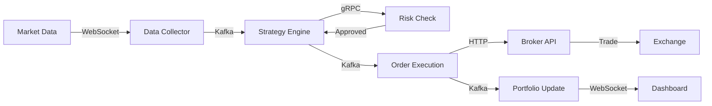

# JTS Architecture Summary

## 🎯 Architecture at a Glance

### System Overview
The JTS platform is a **comprehensive automated trading system** built with:
- **Layered microservices architecture** with strict boundaries
- **Domain-Driven Design** for clear business contexts
- **Event-driven communication** via Kafka for scalability
- **Multi-broker support** with unified interfaces
- **Platform isolation** (Windows for Creon, Linux for everything else)

### Key Architecture Decisions

| Decision | Choice | Rationale |
|----------|--------|-----------|
| **Monorepo Tool** | Nx Workspace | Efficient builds, dependency graph, code generation |
| **Backend Framework** | NestJS (TypeScript) | Type safety, decorators, microservice support |
| **Broker Integration** | FastAPI (Python) for Creon | Windows COM object compatibility |
| **Communication** | gRPC (sync) + Kafka (async) | Low latency for critical paths, scalability for events |
| **Time-Series DB** | ClickHouse | Optimized for OHLCV data and analytics |
| **Caching** | Redis | Distributed cache, rate limiting, sessions |
| **Frontend** | Next.js PWA | Server-side rendering, offline support, push notifications |

## 📊 Architecture Layers

```
┌─────────────────────────────────────┐
│     PRESENTATION (React PWA)        │ ← User Interface
├─────────────────────────────────────┤
│      GATEWAY (Express/Kong)         │ ← API Management  
├─────────────────────────────────────┤
│        BUSINESS SERVICES            │ ← Core Logic
│  Strategy | Risk | Portfolio | Order│
├─────────────────────────────────────┤
│      INTEGRATION SERVICES           │ ← External Systems
│   Market Data | Notifications       │
├─────────────────────────────────────┤
│      MESSAGING (Kafka/Redis)        │ ← Event Bus & Cache
├─────────────────────────────────────┤
│         BROKER SERVICES             │ ← Exchange APIs
│  Creon | KIS | Binance | Upbit      │
├─────────────────────────────────────┤
│      DATA (PostgreSQL/ClickHouse)   │ ← Persistence
└─────────────────────────────────────┘
```

## 🚀 Quick Start Commands

```bash
# Initialize the workspace
npx create-nx-workspace@latest jts --preset=nest

# Generate a new service
nx g @nestjs/schematics:app business/new-service

# Generate a shared library
nx g @nx/workspace:lib shared/new-lib

# Run affected tests
nx affected:test --base=main

# Build all services
nx run-many --target=build --all

# Start development environment
docker-compose up -d  # Infrastructure
nx serve api-gateway  # Gateway
nx serve strategy-engine  # Business service
```

## 🏗️ Workspace Structure

```
jts/
├── apps/                    # Microservices
│   ├── presentation/       # UI applications
│   ├── gateway/           # API gateways
│   ├── business/          # Core business logic
│   ├── integration/       # External integrations
│   ├── brokers/          # Broker APIs
│   └── platform/         # Infrastructure services
├── libs/                   # Shared code
│   ├── shared/           # Common utilities
│   ├── domain/           # Domain models
│   ├── infrastructure/   # Technical libraries
│   └── brokers/          # Broker interfaces
└── infrastructure/        # Deployment configs
```

## 🔄 Data Flow Example



## 🎮 Service Communication Patterns

### Synchronous (gRPC)
- **Use Case**: Low-latency, request-response
- **Example**: Strategy Engine → Risk Management (risk check)
- **Timeout**: 100ms for critical paths

### Asynchronous (Kafka)
- **Use Case**: Event streaming, decoupling
- **Example**: Order Execution → Portfolio Tracker (trade executed)
- **Retention**: 1-30 days based on topic

### Caching (Redis)
- **Use Case**: Session, rate limiting, hot data
- **Example**: Real-time prices, user sessions
- **TTL**: 5 minutes for prices, 24 hours for sessions

## 📈 Rate Limiting Strategy

| Broker | Limit | Window | Strategy |
|--------|-------|--------|----------|
| **Creon** | 60 requests | 15 seconds | Sliding window with queue |
| **KIS** | 20 requests | 1 second | Token bucket per account |
| **Binance** | 1200 weight | 1 minute | Weight-based limiting |
| **Upbit** | 10 requests | 1 second | Fixed window |

## 💾 Storage Architecture

### Hot Storage (4TB NVMe)
```
2TB - ClickHouse (time-series)
800GB - PostgreSQL (transactions)
600GB - Kafka (event streams)
200GB - MongoDB (configurations)
50GB - Redis (cache)
350GB - System & Docker
```

### Warm Storage (SATA SSD)
- Recent historical data (7-90 days)
- Completed trades and reports

### Cold Storage (16.4TB NAS)
- Historical archives (>90 days)
- Backups and audit logs

## 🔐 Security Layers

1. **Network**: VPN, TLS, segmentation
2. **Application**: JWT, RBAC, API keys
3. **Data**: Encryption at rest/transit
4. **Trading**: 2FA, risk limits, audit logs

## 📊 Key Metrics to Monitor

### Technical Metrics
- API latency < 100ms (p95)
- Order execution < 500ms
- System uptime > 99.9%
- Kafka lag < 1 second

### Business Metrics
- Trade success rate > 95%
- Risk limit breaches < 1/month
- Portfolio accuracy > 99.9%
- Strategy performance vs backtest

## 🚦 Implementation Phases

### Phase 1: Foundation (Weeks 1-2)
✅ Core infrastructure  
✅ Creon integration  
✅ Basic trading capability

### Phase 2: Risk & Portfolio (Weeks 3-4)
⏳ Risk management  
⏳ Portfolio tracking  
⏳ API gateway

### Phase 3: Multi-Broker (Weeks 5-6)
⏳ KIS integration  
⏳ Crypto brokers  
⏳ Unified interface

### Phase 4: Advanced Features (Weeks 7-8)
⏳ DSL engine  
⏳ Backtesting  
⏳ Notifications

### Phase 5: Production (Weeks 9-10)
⏳ Monitoring  
⏳ Optimization  
⏳ Deployment

## 🔧 Development Best Practices

1. **Domain-Driven Design**: Keep bounded contexts separate
2. **Event Sourcing**: Maintain audit trail for all trades
3. **Circuit Breakers**: Prevent cascade failures
4. **Idempotency**: Handle duplicate messages gracefully
5. **Observability**: Correlation IDs for distributed tracing
6. **Testing**: 80% coverage for critical paths
7. **Documentation**: API-first design with OpenAPI
8. **Security**: Never log sensitive data

## 📚 Related Documentation

- [Integrated Architecture](./INTEGRATED_ARCHITECTURE.md) - Detailed system design
- [Implementation Roadmap](./IMPLEMENTATION_ROADMAP.md) - Step-by-step guide
- [Nx Workspace Guide](../specs/1000/1003/spec.md) - Monorepo setup

---

**Architecture Principles**: Scalability | Resilience | Performance | Maintainability | Security