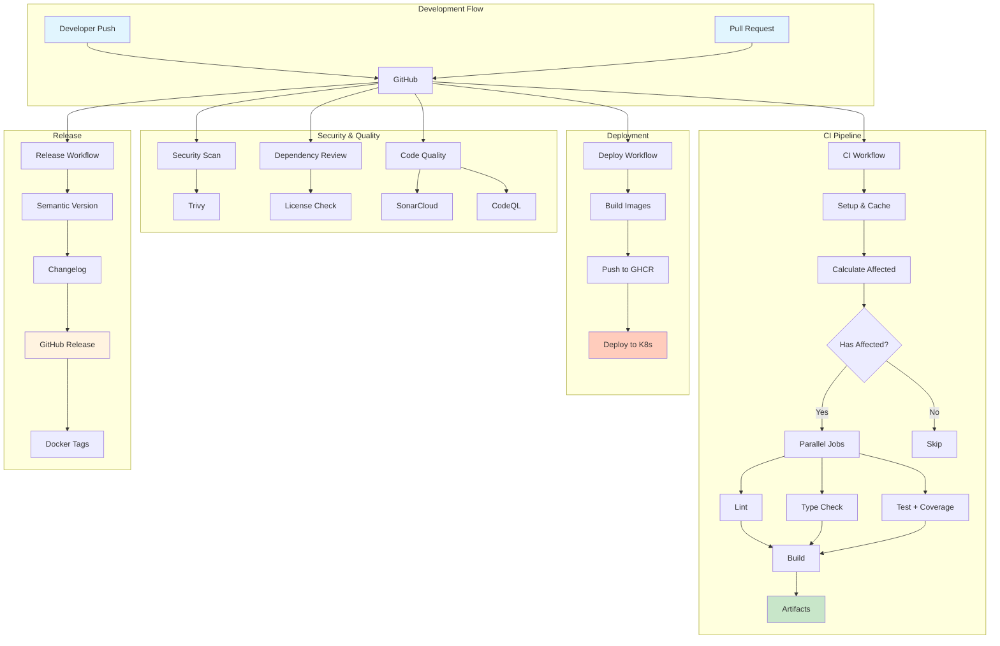

# CI/CD Pipeline Architecture

**Generated from spec**: [[E01-F03-T06] Configure CI/CD Pipeline and Automation](../../../specs/E01/F03/T06/E01-F03-T06.spec.md)

## Overview

The JTS CI/CD pipeline is built on GitHub Actions to provide automated continuous integration, delivery, and deployment for our NestJS monorepo. The architecture leverages Nx's affected commands for optimal build performance and implements comprehensive quality gates.

## Architecture Diagram



## Pipeline Components

### 1. Main CI Pipeline (`ci.yml`)

**Purpose**: Automated testing and validation for every code change

**Key Features**:
- **Nx Affected Builds**: Only builds/tests changed projects and their dependencies
- **Parallel Execution**: Runs lint, type-check, and tests in parallel for speed
- **Intelligent Caching**: Uses GitHub Actions cache for Nx and npm dependencies
- **Coverage Reporting**: Integrates with Codecov for test coverage tracking

**Flow**:
1. Checkout code with full history for affected calculation
2. Setup Node.js environment with caching
3. Calculate affected projects using Nx
4. Run quality checks in parallel (if affected)
5. Build affected applications
6. Upload artifacts for downstream use

### 2. Deployment Pipeline (`deploy.yml`)

**Purpose**: Manual deployment to staging and production environments

**Key Features**:
- **Environment Selection**: Choose between staging and production
- **Service-Specific Deployment**: Deploy single service or all services
- **Container Registry**: Uses GitHub Container Registry (ghcr.io)
- **Rollback Support**: Automatic rollback on deployment failure

**Flow**:
1. Manual trigger with environment and service selection
2. Build service(s) with production configuration
3. Create and push Docker images
4. Deploy to Kubernetes cluster
5. Verify deployment health
6. Rollback if needed

### 3. Code Quality Pipeline (`code-quality.yml`)

**Purpose**: Continuous code quality and security analysis

**Key Features**:
- **SonarCloud Analysis**: Code quality metrics and technical debt
- **CodeQL Scanning**: Security vulnerability detection
- **Bundle Size Analysis**: Monitor application size
- **License Compatibility**: Ensure license compliance

**Flow**:
1. Run on PRs and weekly schedule
2. Execute test suite with coverage
3. Analyze with SonarCloud
4. Scan with CodeQL
5. Generate quality report

### 4. Release Pipeline (`release.yml`)

**Purpose**: Automated semantic versioning and release management

**Key Features**:
- **Semantic Versioning**: Automatic version bumping based on commits
- **Changelog Generation**: Automated changelog from commit messages
- **Multi-format Tagging**: Docker images tagged with various version formats
- **Release Artifacts**: Packaged distributions attached to releases

**Flow**:
1. Trigger on main branch push
2. Analyze commits for version bump
3. Generate changelog
4. Create GitHub release
5. Tag Docker images with version
6. Create deployment checklist issue

### 5. Dependency Management (`dependabot.yml`)

**Purpose**: Automated dependency updates and security patches

**Key Features**:
- **Grouped Updates**: Related dependencies updated together
- **Weekly Schedule**: Minimizes disruption
- **Multi-ecosystem**: Covers npm, Docker, and GitHub Actions
- **Smart PR Limits**: Prevents overwhelming the team

## Security Measures

### Vulnerability Scanning
- **Trivy**: Filesystem vulnerability scanning on every PR
- **CodeQL**: Deep code analysis for security issues
- **Dependency Review**: Checks for known vulnerable dependencies
- **NPM Audit**: Regular security audits of npm packages

### Access Control
- **GITHUB_TOKEN**: Scoped permissions for each job
- **Environment Secrets**: Production secrets protected by environment rules
- **Manual Approval**: Required for production deployments

## Performance Optimizations

### Nx Affected Commands
```bash
# Calculate affected projects
npx nx print-affected --base=$BASE --head=HEAD

# Run only affected tests
npx nx affected --target=test --base=$BASE

# Build only affected apps
npx nx affected --target=build --base=$BASE
```

### Caching Strategy
1. **NPM Cache**: Node modules cached by package-lock.json hash
2. **Nx Cache**: Build artifacts cached by computation hash
3. **Docker Layer Cache**: Reuses unchanged layers in image builds
4. **GitHub Actions Cache**: 7-day retention for build artifacts

## Monitoring and Observability

### Build Metrics
- **Pipeline Duration**: Target <5 minutes for affected builds
- **Test Coverage**: Minimum 80% for critical paths
- **Build Success Rate**: Track failures and flaky tests
- **Artifact Size**: Monitor bundle size trends

### Quality Gates
- **Required Checks**: All must pass before merge
- **Coverage Threshold**: Enforced via Codecov
- **Security Scan**: Block high-severity vulnerabilities
- **Type Safety**: 100% TypeScript compilation required

## Best Practices

### Commit Message Convention
```
type(scope): description

Types: feat, fix, docs, style, refactor, perf, test, chore
Scope: service name or component
Description: Clear, concise change summary

Example: feat(auth): add JWT refresh token support
```

### Branch Protection Rules
- **Require PR Reviews**: At least 1 approval required
- **Require Status Checks**: CI must pass
- **Dismiss Stale Reviews**: On new commits
- **Include Administrators**: No bypassing rules

### Deployment Strategy
1. **Feature Branches**: Develop in isolation
2. **Pull Requests**: Code review and CI validation
3. **Staging Deployment**: Automatic on main merge
4. **Production Deployment**: Manual with approval

## Troubleshooting Guide

### Common Issues

**Issue**: Nx affected not detecting changes
```bash
# Solution: Ensure full git history
git fetch --unshallow

# Verify base commit
git log --oneline -n 10
```

**Issue**: Cache miss causing slow builds
```bash
# Clear and rebuild cache
npm ci
npx nx reset
npx nx run-many --target=build --all
```

**Issue**: Docker build failing
```bash
# Check Dockerfile syntax
docker build -f apps/service/Dockerfile .

# Verify build context
ls -la dist/apps/service/
```

## Maintenance Notes

### Regular Tasks
- **Weekly**: Review Dependabot PRs
- **Monthly**: Analyze build metrics and optimize
- **Quarterly**: Update GitHub Actions versions
- **Yearly**: Review and update security policies

### Performance Monitoring
- Track CI pipeline duration trends
- Monitor cache hit rates
- Analyze test execution times
- Review resource usage

## Integration Points

### External Services
- **GitHub Container Registry**: Docker image storage
- **Codecov**: Test coverage reporting
- **SonarCloud**: Code quality analysis
- **Dependabot**: Dependency management

### Internal Services
- **Nx Cloud** (optional): Distributed caching
- **Kubernetes**: Container orchestration
- **Monitoring Stack**: Prometheus, Grafana
- **Log Aggregation**: ELK stack or similar

## Future Enhancements

### Planned Improvements
1. **Nx Cloud Integration**: For distributed task execution
2. **Canary Deployments**: Gradual rollout support
3. **Performance Testing**: Automated load testing in CI
4. **Security Scanning**: Enhanced SAST/DAST integration
5. **Cost Optimization**: Spot instances for CI runners