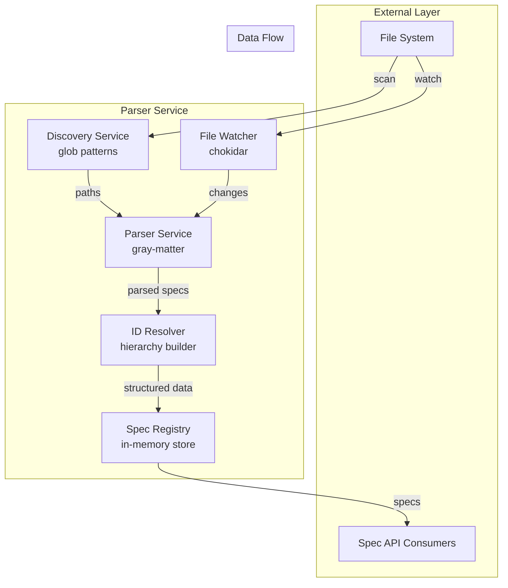
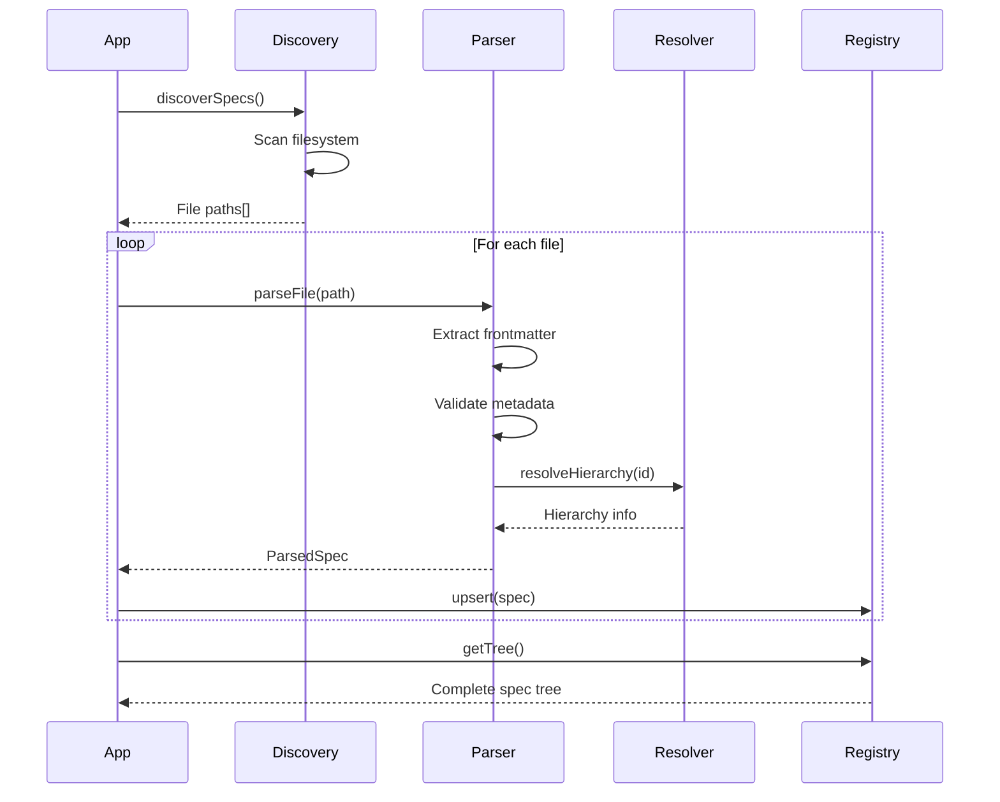
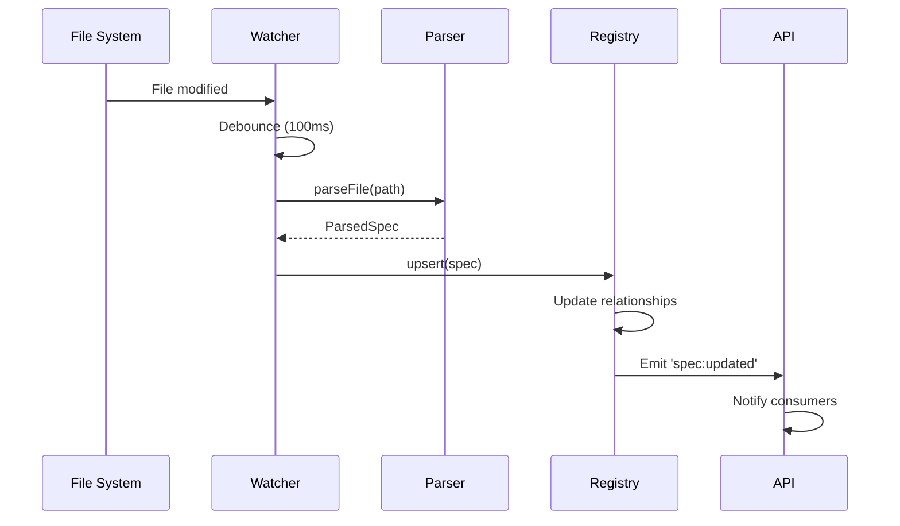

# E13-F01: Spec Parser Service - Architecture Documentation

## 📋 Overview

The Spec Parser Service is the foundational component of the Spec Management API (E13), responsible for discovering, parsing, and managing `.spec.md` files across the project. This service provides the core data layer that all other spec-related features depend upon.

## 🎯 Purpose & Goals

### Primary Objectives
1. **Efficient File Discovery**: Automatically discover all `.spec.md` files in the project
2. **Robust Parsing**: Extract YAML frontmatter and markdown content with error resilience
3. **Hierarchical Organization**: Build and maintain parent-child relationships between specs
4. **Real-time Updates**: Detect and process file changes immediately
5. **Fast Access**: Provide O(1) lookup performance for spec retrieval

### Design Principles
- **Fail-Safe**: Gracefully handle malformed files without service disruption
- **Performance-First**: Optimize for sub-second operations on 1000+ specs
- **Memory-Efficient**: Minimize memory footprint through smart caching
- **Observable**: Emit events for all state changes
- **Testable**: Maintain 95%+ test coverage

## 🏗️ Architecture Overview



## 🔧 Component Architecture

### 1. File Discovery Service (`spec-discovery.service.ts`)

**Purpose**: Scan filesystem for spec files during startup and on-demand

**Key Responsibilities**:
- Recursive directory traversal using glob patterns
- Filter files by `.spec.md` extension
- Build initial file list for parsing
- Handle permission errors gracefully

**Implementation Details**:
```typescript
class SpecDiscoveryService {
  // Discovers all spec files in the configured directory
  async discoverSpecs(baseDir: string): Promise<string[]> {
    // Uses glob pattern: **/*.spec.md
    // Returns absolute paths for found files
  }
  
  // Validates file is readable and valid spec
  async validateSpecFile(path: string): Promise<boolean> {
    // Checks file exists, is readable, has .spec.md extension
  }
}
```

### 2. Spec Parser Service (`spec-parser.service.ts`)

**Purpose**: Parse spec files to extract metadata and content

**Key Responsibilities**:
- Extract YAML frontmatter using gray-matter
- Preserve markdown content
- Validate metadata schema
- Handle parsing errors

**Implementation Details**:
```typescript
class SpecParserService {
  // Main parsing entry point
  async parseFile(path: string): Promise<ParsedSpec> {
    // 1. Read file content
    // 2. Parse with gray-matter
    // 3. Validate metadata
    // 4. Extract hierarchy info
    // 5. Return structured data
  }
  
  // Parse raw content string
  parseContent(content: string): ParsedSpec {
    // Uses gray-matter for YAML extraction
    // Returns { metadata, content, rawYaml }
  }
  
  // Validate metadata against schema
  validateMetadata(metadata: any): SpecMetadata {
    // Uses Joi for validation
    // Ensures required fields present
    // Coerces types where needed
  }
}
```

### 3. ID Resolver Utility (`id-resolver.util.ts`)

**Purpose**: Parse spec IDs to understand hierarchy

**Key Responsibilities**:
- Parse ID format (E13, E13-F01, E13-F01-T01)
- Determine spec level (epic, feature, task)
- Extract parent ID from child IDs
- Build relationship mappings

**Implementation Details**:
```typescript
class IdResolver {
  // Parse ID to components
  parseId(id: string): IdComponents {
    // Regex: /^E(\d+)(?:-F(\d+))?(?:-T(\d+))?$/
    // Returns { epic, feature?, task?, level }
  }
  
  // Get parent ID from child
  getParentId(id: string): string | null {
    // E13-F01-T01 → E13-F01
    // E13-F01 → E13
    // E13 → null
  }
  
  // Determine hierarchy level
  getLevel(id: string): 'epic' | 'feature' | 'task' {
    // Based on ID format parsing
  }
}
```

### 4. Spec Registry Service (`spec-registry.service.ts`)

**Purpose**: In-memory storage and retrieval of parsed specs

**Key Responsibilities**:
- Store specs in Map for O(1) access
- Maintain parent-child relationships
- Build hierarchical tree structure
- Emit change events

**Implementation Details**:
```typescript
class SpecRegistryService {
  private specs = new Map<string, Spec>();
  private childrenMap = new Map<string, Set<string>>();
  
  // Core CRUD operations
  upsert(spec: Spec): void {
    // 1. Store in main map
    // 2. Update parent's children set
    // 3. Emit change event
  }
  
  get(id: string): Spec | undefined {
    // Direct Map lookup - O(1)
  }
  
  getChildren(parentId: string): Spec[] {
    // Use childrenMap for fast retrieval
  }
  
  // Build complete tree structure
  getTree(): SpecTreeNode {
    // Recursive tree building from epics down
  }
}
```

### 5. File Watcher Service (`file-watcher.service.ts`)

**Purpose**: Monitor filesystem for spec file changes

**Key Responsibilities**:
- Watch spec directories for changes
- Detect add/update/delete events
- Trigger incremental parsing
- Debounce rapid changes

**Implementation Details**:
```typescript
class FileWatcherService {
  private watcher: FSWatcher;
  
  startWatching(paths: string[]): void {
    // Configure chokidar with:
    // - ignoreInitial: true
    // - awaitWriteFinish: { stabilityThreshold: 100 }
    // - ignored: /(^|[\/\\])\../
  }
  
  private handleFileChange(event: string, path: string): void {
    // Debounce rapid changes
    // Emit typed events for consumers
    // Trigger reparse if needed
  }
}
```

## 📊 Data Models

### Core Entities

```typescript
// Main spec entity with all data
interface Spec {
  id: string;                    // E13-F01
  metadata: SpecMetadata;         // YAML frontmatter
  content: string;                // Markdown body
  path: string;                   // Absolute file path
  hierarchy: SpecHierarchy;       // Relationships
  parsedAt: Date;                 // Last parse time
  checksum: string;               // Content hash
}

// Metadata from YAML frontmatter
interface SpecMetadata {
  id: string;
  title: string;
  type: 'epic' | 'feature' | 'task';
  status: 'draft' | 'in-progress' | 'completed';
  priority: 'low' | 'medium' | 'high' | 'critical';
  created: string;
  updated: string;
  parent?: string;
  dependencies?: string[];
  assignee?: string;
  tags?: string[];
}

// Hierarchical relationships
interface SpecHierarchy {
  level: 'epic' | 'feature' | 'task';
  parentId?: string;
  childIds: string[];
  depth: number;                  // 0 for epics, 1 for features, 2 for tasks
}

// Tree structure for visualization
interface SpecTreeNode {
  spec: Spec;
  children: SpecTreeNode[];
  expanded?: boolean;             // UI state
}
```

## 🔄 Data Flow Sequences

### 1. Initial Load Sequence



### 2. File Change Sequence



## 🚀 Performance Considerations

### Memory Optimization

1. **Lazy Content Loading**
   - Store content separately from metadata
   - Load full content only when requested
   - Keep frequently accessed fields in memory

2. **Efficient Data Structures**
   - Use Map for O(1) lookups
   - Maintain separate index for relationships
   - Cache computed values (tree structure)

3. **Memory Limits**
   - Target: < 100MB for 1000 specs
   - Average spec: ~100KB (metadata: 1KB, content: 99KB)
   - Strategy: Stream large content, paginate results

### Performance Targets

| Operation | Target | Strategy |
|-----------|--------|----------|
| Initial load (1000 specs) | < 5s | Parallel parsing, batch operations |
| Single spec lookup | < 1ms | Map-based storage |
| Tree generation | < 50ms | Cached structure, incremental updates |
| File change detection | < 100ms | Debounced watcher, focused updates |
| Memory per spec | < 100KB | Lazy loading, content streaming |

## 🛡️ Error Handling Strategy

### Graceful Degradation

1. **Malformed YAML**
   ```typescript
   try {
     const parsed = grayMatter(content);
   } catch (error) {
     // Log error with file path
     // Return partial spec with error flag
     // Continue processing other files
   }
   ```

2. **Missing Required Fields**
   ```typescript
   // Use defaults for missing fields
   const defaults = {
     status: 'draft',
     priority: 'medium',
     created: new Date().toISOString()
   };
   ```

3. **File System Errors**
   ```typescript
   // Handle permission denied, file not found
   // Skip problematic files
   // Log for manual intervention
   ```

### Error Recovery

- **Retry Logic**: Exponential backoff for transient failures
- **Partial Updates**: Process valid specs even if some fail
- **Error Reporting**: Detailed logs with actionable messages
- **Fallback Values**: Sensible defaults for missing data

## 🧪 Testing Strategy

### Unit Tests (70% coverage)

1. **Parser Tests**
   - Valid YAML parsing
   - Malformed YAML handling
   - Edge cases (empty files, huge files)
   - Special characters in content

2. **ID Resolver Tests**
   - All ID format variations
   - Invalid ID handling
   - Parent extraction logic
   - Level determination

3. **Registry Tests**
   - CRUD operations
   - Relationship management
   - Tree building
   - Event emission

### Integration Tests (20% coverage)

1. **File Discovery**
   - Real filesystem scanning
   - Permission handling
   - Symbolic link following
   - Large directory trees

2. **End-to-End Flow**
   - Complete parse cycle
   - File change handling
   - Registry updates
   - Event propagation

### Performance Tests (10% coverage)

1. **Load Tests**
   - 1000+ spec files
   - Memory usage monitoring
   - Parse time benchmarks
   - Lookup performance

## 📈 Monitoring & Observability

### Key Metrics

1. **Performance Metrics**
   - Parse time per file
   - Total load time
   - Memory usage
   - Cache hit rates

2. **Health Metrics**
   - Active spec count
   - Failed parse count
   - File watcher status
   - Last update timestamp

3. **Business Metrics**
   - Specs by status
   - Specs by type
   - Update frequency
   - Orphaned specs

### Logging Strategy

```typescript
// Structured logging with context
logger.info('Spec parsed successfully', {
  specId: spec.id,
  path: spec.path,
  parseTime: elapsed,
  contentSize: content.length
});

logger.error('Failed to parse spec', {
  path: filePath,
  error: error.message,
  stack: error.stack
});
```

## 🔮 Future Enhancements

### Phase 2 Considerations

1. **Database Persistence**
   - Store parsed specs in PostgreSQL
   - Implement change history
   - Enable multi-instance synchronization

2. **Advanced Caching**
   - Redis integration for distributed cache
   - Content-based cache invalidation
   - Precomputed aggregations

3. **Search Capabilities**
   - Full-text search on content
   - Fuzzy ID matching
   - Tag-based filtering

4. **Performance Optimizations**
   - Worker threads for parsing
   - Incremental tree updates
   - Differential sync for changes

## 📚 References

### External Dependencies
- [gray-matter](https://github.com/jonschlinkert/gray-matter) - YAML frontmatter parsing
- [chokidar](https://github.com/paulmillr/chokidar) - Cross-platform file watching
- [glob](https://github.com/isaacs/node-glob) - File pattern matching
- [joi](https://github.com/sideway/joi) - Schema validation

### Related Specs
- [E13 - Spec Management API](specs/E13/E13.spec.md)
- [E13-F02 - Spec Renderer Service](specs/E13/F02/spec.md)
- [E13-F03 - WebSocket Updates](specs/E13/F03/spec.md)
- [E13-F04 - Caching Layer](specs/E13/F04/spec.md)

### Implementation Files
- Service implementation: `apps/spec-api/src/modules/parser/`
- Test files: `apps/spec-api/src/modules/parser/__tests__/`
- Configuration: `apps/spec-api/src/config/parser.config.ts`

---
*This architecture document provides comprehensive guidance for implementing the Spec Parser Service (E13-F01)*