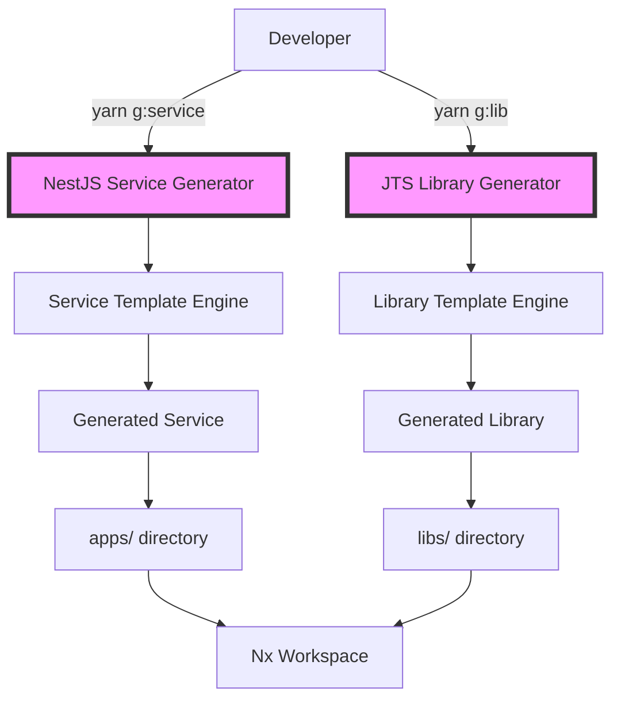

# Development Tooling and Generators - Implementation Walkthrough

## Component: JTS Custom Generators

### Spec: [[E01-F03-T05] Create Development Tooling and Generators](../../specs/E01/F03/T05/E01-F03-T05.spec.md)

### GitHub Issue: [Issue#79 Create Development Tooling and Generators](https://github.com/ddoachi/jts/issues/79)

### Purpose

The JTS generators solve a critical problem in microservice development: maintaining consistency across dozens of services and libraries while accelerating development speed. Without generators, developers would spend hours setting up boilerplate, risking inconsistent patterns that complicate maintenance and onboarding.

### Architecture Position



## Key Concepts (Educational Focus)

### Concept 1: Code Generation with Nx Devkit

**Definition**: Nx Devkit provides APIs to manipulate the file system and project configuration programmatically.

**Why it matters**: Enables creation of sophisticated generators that understand the monorepo structure and maintain consistency.

**Example**:

```typescript
// Using Nx Devkit to generate files from templates
generateFiles(
  tree, // Virtual file system
  path.join(__dirname, 'files'), // Template source
  options.projectRoot, // Destination
  templateOptions, // Variables for substitution
);
```

### Concept 2: Template Substitution with EJS

**Definition**: EJS (Embedded JavaScript) allows dynamic content generation in template files using `<%= %>` syntax.

**Why it matters**: Templates can adapt to user input, creating customized output while maintaining structure.

**Common pitfalls**:

- Forgetting the `__template__` suffix on template files
- Not providing all required template variables

**Best practices**:

- Use descriptive variable names
- Provide sensible defaults
- Validate template variables before generation

### Concept 3: Architectural Enforcement

**Definition**: Generators enforce architectural patterns through folder structure and module organization.

**Why it matters**: Consistent architecture across all services reduces cognitive load and improves maintainability.

**Example**: Every generated service follows DDD structure:

```
src/
├── app/        # Application layer
├── domain/     # Business logic
├── infra/      # External integrations
└── shared/     # Cross-cutting concerns
```

## Step-by-Step Code Walkthrough

### 1. Generator Entry Point

**File**: `tools/generators/nestjs-service/index.ts:82-108`

```typescript
export default async function serviceGenerator(
  tree: Tree,
  options: ServiceGeneratorSchema,
): Promise<() => void> {
  // Step 1: Normalize and validate options
  const normalizedOptions = normalizeOptions(tree, options);

  // Step 2: Generate base NestJS application
  await applicationGenerator(tree, {
    name: normalizedOptions.projectName,
    directory: normalizedOptions.projectDirectory,
    tags: normalizedOptions.parsedTags.join(','),
    unitTestRunner: 'jest',
    linter: 'eslint',
    skipFormat: true,
  });

  // Step 3: Apply JTS-specific templates
  addCustomFiles(tree, normalizedOptions);

  // Step 4: Update project configuration
  updateProjectConfig(tree, normalizedOptions);

  // Step 5: Format all generated files
  await formatFiles(tree);

  return () => installPackagesTask(tree);
}
```

**What happens here**: The main orchestrator that coordinates all generation steps.

**Why this approach**: Separates concerns - normalization, generation, customization, and formatting are distinct phases.

### 2. Option Normalization

**File**: `tools/generators/nestjs-service/index.ts:122-153`

```typescript
function normalizeOptions(tree: Tree, options: ServiceGeneratorSchema): NormalizedOptions {
  // Convert name to kebab-case for consistency
  const name = names(options.name).fileName;

  // Calculate project directory
  const projectDirectory = options.directory
    ? `${names(options.directory).fileName}/${name}`
    : name;

  // Project name uses dashes instead of slashes
  const projectName = projectDirectory.replace(new RegExp('/', 'g'), '-');

  // Auto-assign port if not provided
  const port = options.port || assignNextAvailablePort(tree);

  return { ...normalizedOptions };
}
```

**What happens here**: Raw user input is transformed into consistent, validated options.

**Why this approach**: Ensures all names follow conventions and prevents conflicts (especially port assignments).

### 3. Port Assignment Algorithm

**File**: `tools/generators/nestjs-service/index.ts:161-185`

```typescript
function assignNextAvailablePort(tree: Tree): number {
  const basePort = 3000;
  const maxPort = 3999;
  let port = basePort;

  // Read all project.json files to find used ports
  const appsDir = tree.children('apps');
  const usedPorts = new Set<number>();

  for (const app of appsDir) {
    const projectJsonPath = `apps/${app}/project.json`;
    if (tree.exists(projectJsonPath)) {
      const projectJson = JSON.parse(tree.read(projectJsonPath)!.toString());
      const serveOptions = projectJson.targets?.serve?.options;
      if (serveOptions?.port) {
        usedPorts.add(serveOptions.port);
      }
    }
  }

  // Find first available port
  while (usedPorts.has(port) && port <= maxPort) {
    port++;
  }

  return port;
}
```

**What happens here**: Scans existing services to find an unused port in the designated range.

**Why this approach**: Prevents port conflicts that would cause services to fail on startup.

### 4. Template Application

**File**: `tools/generators/nestjs-service/index.ts:194-211`

```typescript
function addCustomFiles(tree: Tree, options: NormalizedOptions): void {
  const templateOptions = {
    ...options,
    ...names(options.name), // Adds className, fileName, etc.
    offsetFromRoot: offsetFromRoot(options.projectRoot),
    template: '', // Special marker for EJS
  };

  // Generate files from templates
  generateFiles(tree, path.join(__dirname, 'files'), options.projectRoot, templateOptions);

  // Add optional features
  if (options.includeKafka) generateKafkaConfig(tree, options);
  if (options.includeGrpc) generateGrpcConfig(tree, options);
  if (options.includeWebsocket) generateWebsocketConfig(tree, options);
}
```

**What happens here**: Template files are processed with variable substitution and copied to the destination.

**Why this approach**: Allows conditional features while maintaining a clean base template structure.

### 5. Library Scope Management

**File**: `tools/generators/jts-library/index.ts:110-143`

```typescript
function normalizeOptions(tree: Tree, options: LibraryGeneratorSchema): NormalizedOptions {
  // Validate scope
  const validScopes = ['shared', 'domain', 'infrastructure', 'brokers'];
  if (!validScopes.includes(options.scope)) {
    throw new Error(`Invalid scope: ${options.scope}`);
  }

  // Calculate directory based on scope
  const projectDirectory = options.directory
    ? `${options.scope}/${names(options.directory).fileName}/${name}`
    : `${options.scope}/${name}`;

  // Import path follows @jts convention
  const importPath = `@jts/${options.scope}/${name}`;

  return { ...normalizedOptions };
}
```

**What happens here**: Libraries are organized by architectural scope with predictable import paths.

**Why this approach**: Enforces architectural boundaries - shared libraries can't import from domain, etc.

## Common Scenarios & Troubleshooting

### Scenario A: Creating a Trading Service

1. Developer runs: `yarn g:service --name=trading-engine`
2. Generator normalizes name → `tools/generators/nestjs-service/index.ts:122`
3. Port scanner finds 3000 is used, assigns 3001 → `index.ts:161`
4. Base NestJS app generated → `index.ts:85`
5. JTS templates applied → `index.ts:194`
6. Files formatted and saved → `index.ts:105`

**Result**: Complete service at `apps/trading-engine/` with port 3001

### Scenario B: Port Conflict Resolution

**Problem**: All ports 3000-3999 are in use

1. Generator scans ports → `index.ts:161-185`
2. No available port found
3. Error thrown: "No available ports in range 3000-3999"

**Solution**:

- Manually specify port outside range: `--port=4000`
- Or clean up unused services

### Scenario C: Creating Domain Library

1. Developer runs: `yarn g:lib --name=trading-logic --scope=domain`
2. Scope validated → `jts-library/index.ts:113`
3. Path calculated: `libs/domain/trading-logic/`
4. Import path set: `@jts/domain/trading-logic`
5. Domain-specific structure created (entities, services, events)

**Result**: Domain library with DDD structure ready for business logic

## Testing Guide

### Unit Tests

**Generator Tests**: `scripts/test-generators.js`

```javascript
// Test case 1: Verify all template files exist
for (const file of generator.requiredFiles) {
  if (fs.existsSync(filePath)) {
    console.log(`✅ ${file}`);
  }
}

// Test case 2: Validate schema.json structure
const schema = JSON.parse(fs.readFileSync(schemaPath));
if (schema.$schema && schema.properties) {
  console.log('✅ Valid schema.json');
}
```

**What it tests**: Structural integrity of generators
**Why**: Catches missing templates or malformed schemas before runtime

### Integration Tests

**Manual Testing Flow**:

1. **Create test service**:

```bash
yarn g:service --name=test-service --port=3999
nx build test-service
nx serve test-service
```

2. **Create test library**:

```bash
yarn g:lib --name=test-lib --scope=shared
nx build shared-test-lib
nx test shared-test-lib
```

3. **Verify integration**:

```bash
# Import library in service
# Build and test together
nx affected:build
```

## Maintenance Notes

### Common Issues and Solutions

**Issue 1: Template Variable Not Substituted**

- **Symptom**: `<%= className %>` appears in generated files
- **Cause**: Variable not provided in templateOptions
- **Solution**: Add missing variable to `addCustomFiles()` function

**Issue 2: Generator Command Not Found**

- **Symptom**: `Error: Cannot find generator`
- **Cause**: Nx not finding generator path
- **Solution**: Ensure path in package.json is correct: `nx g ./tools/generators/{name}`

**Issue 3: Generated Service Won't Build**

- **Symptom**: TypeScript errors after generation
- **Cause**: Template using outdated imports or syntax
- **Solution**: Update template files to match current dependencies

### Performance Considerations

- **Generator Speed**: ~2-5 seconds per generation
- **Bottleneck**: File I/O when writing many templates
- **Optimization**: Use `skipFormat: true` during generation, format once at end

### Security Checklist

- ✅ Templates don't include hardcoded secrets
- ✅ Generated .env.example uses placeholder values
- ✅ Dockerfile uses non-root user
- ✅ Port range avoids privileged ports (<1024)

## Advanced Topics

### Extending Generators

To add a new generator type (e.g., worker service):

1. **Copy existing generator**:

```bash
cp -r tools/generators/nestjs-service tools/generators/worker-service
```

2. **Modify schema.json**:

```json
{
  "properties": {
    "queueType": {
      "enum": ["kafka", "rabbitmq", "sqs"]
    }
  }
}
```

3. **Update templates** for worker-specific structure

4. **Add npm script**:

```json
"g:worker": "nx g ./tools/generators/worker-service"
```

### Generator Composition

Generators can call other generators:

```typescript
// In custom generator
await libraryGenerator(tree, {
  name: `${options.name}-types`,
  scope: 'shared',
});
```

This creates related projects automatically.

## Key Takeaways

1. **Consistency is King**: Generators ensure every service follows the same patterns
2. **Time Savings**: 30+ minutes of setup reduced to 5 seconds
3. **Architecture Enforcement**: Structure enforces clean architecture principles
4. **Discoverability**: Predictable paths and structures aid navigation
5. **Maintainability**: Updates to templates propagate to all future projects

## Next Steps

After understanding generators:

1. Create your first service with `yarn g:service`
2. Create supporting libraries with `yarn g:lib`
3. Customize templates for your team's needs
4. Consider creating domain-specific generators
