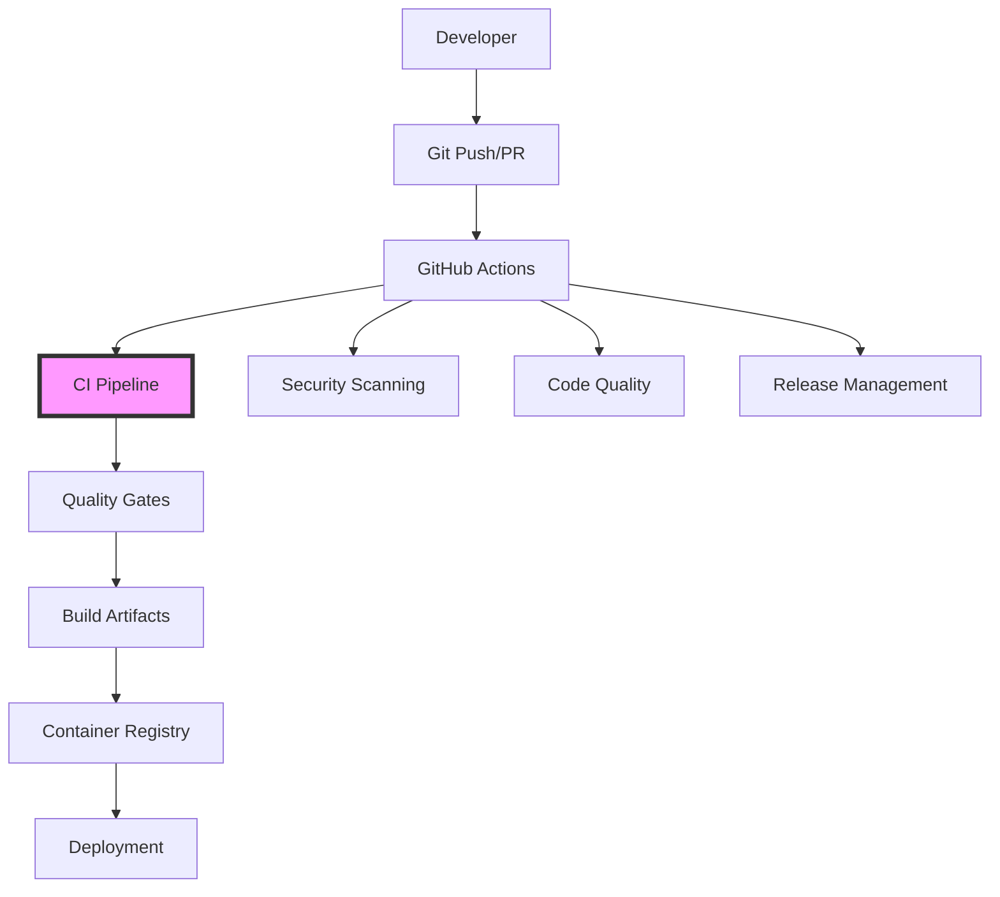

# CI/CD Pipeline Implementation Walkthrough

## Component: GitHub Actions CI/CD Pipeline

### Spec: [[E01-F03-T06] Configure CI/CD Pipeline and Automation](../../specs/E01/F03/T06/E01-F03-T06.spec.md)

### GitHub Issue: [Issue#82 Configure CI/CD Pipeline and Automation](https://github.com/ddoachi/jts/issues/82)

### Purpose

This implementation provides a comprehensive CI/CD pipeline for the JTS monorepo, automating the build, test, and deployment processes. It leverages GitHub Actions and Nx to optimize build times through affected project detection, ensuring only changed code and its dependencies are processed.

### Architecture Position



### Key Concepts (Educational Focus)

**Concept 1: Nx Affected Commands**
- Definition: Nx analyzes the dependency graph to determine which projects are affected by code changes
- Why it matters: Dramatically reduces CI time by only building/testing what changed
- Example:
  ```bash
  # Determine affected projects between commits
  npx nx print-affected --base=main --head=HEAD
  
  # Run tests only for affected projects
  npx nx affected --target=test --base=main
  ```

**Concept 2: GitHub Actions Matrix Strategy**
- Definition: Runs the same job with different parameters in parallel
- Common pitfalls: Over-parallelization can exhaust runner resources
- Best practices: Balance parallelization with resource constraints
- Example from deployment workflow:
  ```yaml
  strategy:
    matrix:
      service: ${{ fromJson(needs.prepare.outputs.services) }}
  ```

**Concept 3: Semantic Versioning**
- Definition: Version numbers convey meaning about underlying changes (MAJOR.MINOR.PATCH)
- Why it matters: Enables automated version management and clear communication of changes
- Example commit for minor release:
  ```
  feat(auth): add OAuth2 support
  ```

### Step-by-Step Code Walkthrough

#### 1. CI Pipeline Initialization
**File**: `.github/workflows/ci.yml:28-70`
```yaml
jobs:
  setup:
    name: Setup
    runs-on: ubuntu-latest
    outputs:
      affected-apps: ${{ steps.affected.outputs.apps }}
      affected-libs: ${{ steps.affected.outputs.libs }}
      has-affected: ${{ steps.affected.outputs.has-affected }}
```
**What happens here**: The setup job calculates which projects are affected by the current changes
**Why this approach**: Outputs are passed to downstream jobs to conditionally execute only necessary work

#### 2. Affected Calculation Logic
**File**: `.github/workflows/ci.yml:71-85`
```yaml
- name: Calculate Affected
  id: affected
  run: |
    if [ "${{ github.event_name }}" == "pull_request" ]; then
      NX_BASE=${{ github.event.pull_request.base.sha }}
    else
      NX_BASE=$(git rev-parse HEAD~1)
    fi
```
**What happens here**: Determines the base commit for comparison based on the trigger event
**Why this approach**: PRs compare against their base branch, while pushes compare against the previous commit

#### 3. Parallel Quality Checks
**File**: `.github/workflows/ci.yml:91-197`
```yaml
lint:
  needs: setup
  if: needs.setup.outputs.has-affected == 'true'
  
type-check:
  needs: setup
  if: needs.setup.outputs.has-affected == 'true'
  
test:
  needs: setup
  if: needs.setup.outputs.has-affected == 'true'
```
**What happens here**: Three jobs run in parallel, but only if there are affected projects
**Why this approach**: Maximizes speed through parallelization while avoiding unnecessary work

#### 4. Security Scanning Integration
**File**: `.github/workflows/ci.yml:274-306`
```yaml
security-scan:
  name: Security Scan
  if: github.event_name == 'pull_request'
  steps:
    - name: Run Trivy vulnerability scanner
      uses: aquasecurity/trivy-action@master
```
**What happens here**: Scans the filesystem for known vulnerabilities
**Why this approach**: Catches security issues before they reach production

#### 5. Deployment Workflow
**File**: `.github/workflows/deploy.yml:16-30`
```yaml
on:
  workflow_dispatch:
    inputs:
      environment:
        type: choice
        options:
          - staging
          - production
```
**What happens here**: Manual deployment trigger with environment selection
**Why this approach**: Provides control over when and where deployments occur

#### 6. Docker Image Building
**File**: `.github/workflows/deploy.yml:118-133`
```yaml
- name: Build and Push Docker Image
  uses: docker/build-push-action@v5
  with:
    tags: |
      ${{ env.REGISTRY }}/${{ github.repository }}/${{ matrix.service }}:${{ github.sha }}
      ${{ env.REGISTRY }}/${{ github.repository }}/${{ matrix.service }}:${{ inputs.environment }}
```
**What happens here**: Builds and tags Docker images with multiple identifiers
**Why this approach**: SHA tag for immutability, environment tag for easy reference

#### 7. Dependabot Configuration
**File**: `.github/dependabot.yml:22-49`
```yaml
groups:
  nx:
    patterns:
      - '@nx/*'
      - 'nx'
    update-types:
      - 'minor'
      - 'patch'
```
**What happens here**: Groups related dependencies for cleaner PR management
**Why this approach**: Reduces PR noise while maintaining security updates

#### 8. Release Automation
**File**: `.github/workflows/release.yml:96-145`
```yaml
- name: Semantic Release
  run: |
    npx semantic-release
```
**What happens here**: Analyzes commits and automatically creates releases
**Why this approach**: Ensures consistent versioning based on commit conventions

### Common Scenarios & Troubleshooting

**Scenario A: Developer Creates Pull Request**
1. Push branch to GitHub
2. CI workflow triggers → `.github/workflows/ci.yml:4-6`
3. Setup calculates affected → `.github/workflows/ci.yml:71-85`
4. Parallel checks run → `.github/workflows/ci.yml:91-197`
5. Security scan executes → `.github/workflows/ci.yml:274-306`
6. Status reported to PR → GitHub UI

**Scenario B: Production Deployment**
1. Trigger deployment manually → `.github/workflows/deploy.yml:17`
2. Select production environment → `.github/workflows/deploy.yml:23`
3. Build Docker images → `.github/workflows/deploy.yml:65-133`
4. Deploy to Kubernetes → `.github/workflows/deploy.yml:140-174`
5. Verify deployment → `.github/workflows/deploy.yml:176-184`

**Scenario C: Failed CI Pipeline**
```bash
# Check which step failed
gh run view <run-id>

# Re-run failed jobs
gh run rerun <run-id> --failed

# Debug locally with act
act -j <job-name> --verbose
```

### Testing Guide

**Manual Testing**:
```bash
# Validate workflow syntax
for workflow in .github/workflows/*.yml; do
  echo "Checking: $workflow"
  # YAML syntax check
  yamllint $workflow
done

# Test affected calculation
npx nx print-affected --base=main --head=HEAD

# Simulate CI locally with act
act push --job setup
```

**Integration Testing**:
```bash
# Test deployment workflow
gh workflow run deploy.yml \
  -f environment=staging \
  -f service=auth-service

# Monitor deployment
gh run watch
```

### Maintenance Notes

**Common Issues and Solutions**:

1. **Nx Cache Misses**
   - Problem: Builds taking longer than expected
   - Solution: Check cache key configuration in `.github/workflows/ci.yml:52-58`
   - Verification: `gh run view --log | grep "Cache hit"`

2. **Flaky Tests**
   - Problem: Tests pass locally but fail in CI
   - Solution: Increase timeouts or add retry logic
   - Debug: `npx nx test <project> --configuration=ci --verbose`

3. **Docker Build Failures**
   - Problem: Image build fails in CI
   - Solution: Verify Dockerfile paths and build context
   - Debug: Build locally first: `docker build -f apps/service/Dockerfile .`

**Performance Considerations**:
- Monitor workflow duration: Target <5 min for PRs
- Track cache effectiveness: >80% hit rate expected
- Review parallel job usage: Balance speed vs runner costs

**Security Checklist**:
- [ ] Secrets properly scoped to environments
- [ ] Dependency updates reviewed before merge
- [ ] Security scan results addressed promptly
- [ ] Access tokens rotated regularly

### Key Takeaways

1. **Affected Commands**: The foundation of monorepo CI efficiency - only build what changed
2. **Parallel Execution**: Speed through parallelization, but respect resource limits
3. **Security Integration**: Shift-left security with automated scanning on every PR
4. **Semantic Versioning**: Automated releases based on conventional commits
5. **Deployment Control**: Manual triggers for production with environment protection

### Next Steps

After implementing this CI/CD pipeline:

1. **Configure Secrets**: Add required secrets (SONAR_TOKEN, NPM_TOKEN) in repository settings
2. **Setup Environments**: Configure GitHub environments with protection rules
3. **Enable Dependabot**: Review and merge the initial dependency PRs
4. **Test Pipeline**: Create a test PR to verify the entire flow
5. **Monitor Performance**: Track build times and optimize as needed

### Related Documentation

- [GitHub Actions Documentation](https://docs.github.com/en/actions)
- [Nx Affected Commands](https://nx.dev/concepts/affected)
- [Semantic Release](https://semantic-release.gitbook.io/)
- [Trivy Security Scanner](https://aquasecurity.github.io/trivy/)