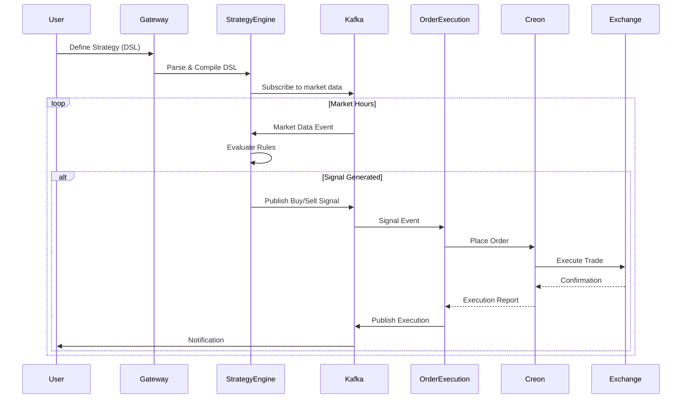

# JTS Architecture Diagram Integration Guide

## How to Include Architecture Diagrams for Better Task Generation

### 1. Mermaid Diagram Format (Recommended)
Include architecture diagrams in Mermaid format within the PRD or as separate files:

```mermaid
graph TB
    subgraph "Presentation Layer"
        PWA[PWA Dashboard]
        Mobile[Mobile App]
    end

    subgraph "Gateway Layer"
        Gateway[API Gateway<br/>- Auth<br/>- Rate Limiting<br/>- Routing]
    end

    subgraph "Business Layer"
        SE[Strategy Engine<br/>- DSL Parser<br/>- Signal Gen]
        OE[Order Execution<br/>- Order Management<br/>- Position Tracking]
        RM[Risk Management<br/>- Kelly Criterion<br/>- Drawdown Control]
        PT[Portfolio Tracker<br/>- P&L Calculation<br/>- Performance Metrics]
    end

    subgraph "Integration Layer"
        MDC[Market Data Collector<br/>- Real-time Data<br/>- Normalization]
        NS[Notification Service<br/>- Push/Email]
    end

    subgraph "Messaging Layer"
        Kafka[Kafka Cluster<br/>- Event Streaming]
        Redis[Redis<br/>- Caching<br/>- Rate Limiting]
    end

    subgraph "Brokers Layer"
        Creon[Creon Service<br/>(Windows)]
        KIS[KIS Service]
        Binance[Binance Service]
        Upbit[Upbit Service]
    end

    subgraph "Data Layer"
        PG[(PostgreSQL<br/>Transactions)]
        CH[(ClickHouse<br/>Time Series)]
        Mongo[(MongoDB<br/>Configs)]
    end

    PWA --> Gateway
    Mobile --> Gateway
    Gateway --> SE
    Gateway --> OE
    Gateway --> RM
    Gateway --> PT
    
    SE --> Kafka
    OE --> Kafka
    RM --> Kafka
    PT --> Kafka
    MDC --> Kafka
    
    Kafka --> OE
    Kafka --> SE
    Kafka --> PT
    Kafka --> NS
    
    OE --> Creon
    OE --> KIS
    OE --> Binance
    OE --> Upbit
    
    MDC --> Creon
    MDC --> KIS
    MDC --> Binance
    MDC --> Upbit
    
    SE --> Redis
    OE --> Redis
    
    OE --> PG
    PT --> PG
    MDC --> CH
    SE --> Mongo
```

### 2. Service Communication Matrix
Include a clear matrix showing service interactions:

| Service | Communicates With | Protocol | Purpose |
|---------|------------------|----------|---------|
| Strategy Engine | Kafka, MongoDB, Redis | gRPC/Event | Signal generation, strategy storage |
| Order Execution | Kafka, PostgreSQL, Brokers | HTTP/Event | Order placement and tracking |
| Market Data Collector | Brokers, ClickHouse, Kafka | WebSocket/Event | Real-time data ingestion |
| Risk Management | Kafka, PostgreSQL | Event | Portfolio risk monitoring |
| API Gateway | All Business Services | HTTP/gRPC | Request routing |

### 3. Data Flow Diagrams
Include sequence diagrams for critical flows:



### 4. Component Dependency Tree
Show clear dependencies for build order:

```yaml
Level 0 (Infrastructure):
  - Kafka Cluster
  - PostgreSQL
  - ClickHouse
  - MongoDB
  - Redis

Level 1 (Core Services):
  - libs/shared (DTOs, Utils)
  - libs/messaging (Kafka client)
  - libs/data (DB clients)

Level 2 (Integration):
  - brokers/creon-service
  - integration/market-data-collector

Level 3 (Business Logic):
  - business/order-execution
  - business/strategy-engine
  - business/risk-management
  - business/portfolio-tracker

Level 4 (Gateway):
  - gateway/api-gateway

Level 5 (Presentation):
  - apps/pwa-dashboard
  - apps/mobile-app
```

### 5. Phase-Aligned Architecture Views
Create phase-specific views showing what gets built when:

#### Phase 1 Architecture (Foundation)
```
Windows Machine          Linux Server
┌─────────────┐         ┌──────────────────────┐
│ Creon API   │◄────────│ Market Data Collector│
│ (FastAPI)   │         │ Strategy Engine      │
└─────────────┘         │ Order Execution      │
                        │ Kafka + ClickHouse   │
                        └──────────────────────┘
```

#### Phase 2 Architecture (Enhanced)
```
Add: PWA Dashboard, Risk Management, Portfolio Tracker
```

#### Phase 3 Architecture (Multi-Broker)
```
Add: KIS, Binance, Upbit services
Add: Unified Broker Abstraction Layer
```

## Benefits of Including Architecture Diagrams

1. **Clear Task Boundaries**: I can better understand service boundaries and generate more focused tasks
2. **Dependency Awareness**: I can identify dependencies and suggest proper build order
3. **Integration Points**: Clear understanding of how services communicate helps generate better integration code
4. **Data Flow Understanding**: Helps generate correct event schemas and API contracts
5. **Performance Considerations**: Visual representation helps identify potential bottlenecks

## How to Provide Architecture Information

### Option 1: Embedded in PRD
```markdown
## System Architecture
[Include Mermaid diagrams here]
```

### Option 2: Separate Architecture File
```
.claude-workflow/
├── specs/
│   ├── prd.md
│   ├── architecture.md  # Dedicated architecture doc
│   └── diagrams/        # Image files if needed
```

### Option 3: Interactive Format
When starting a task, provide:
1. The specific component being worked on
2. Its upstream and downstream dependencies
3. The communication protocols it uses
4. The data it consumes/produces

## Example Task Generation Improvement

**Without Architecture Diagram:**
"Implement order execution service"

**With Architecture Diagram:**
"Implement order execution service that:
- Subscribes to signals.entry.* Kafka topics
- Communicates with Creon/KIS/Binance/Upbit via HTTP
- Publishes to orders.executions topic
- Stores orders in PostgreSQL
- Uses Redis for rate limiting state
- Exposes gRPC API for Gateway"

## Recommended Approach

1. Include a high-level architecture diagram in the PRD
2. Create component-specific diagrams in each service's README
3. Maintain a service dependency matrix
4. Document data flow for critical user journeys
5. Keep architecture diagrams updated as system evolves

This will enable me to:
- Generate more accurate boilerplate
- Create proper service interfaces
- Implement correct communication patterns
- Set up appropriate error handling
- Configure proper monitoring points