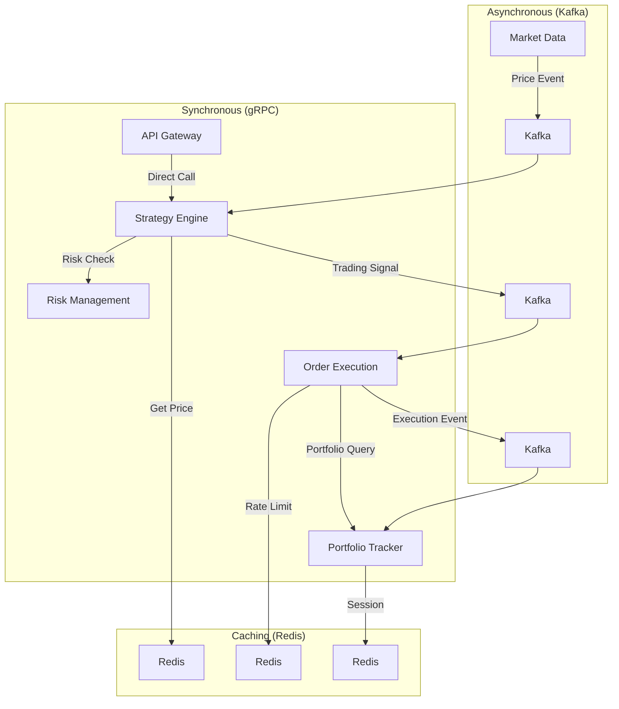
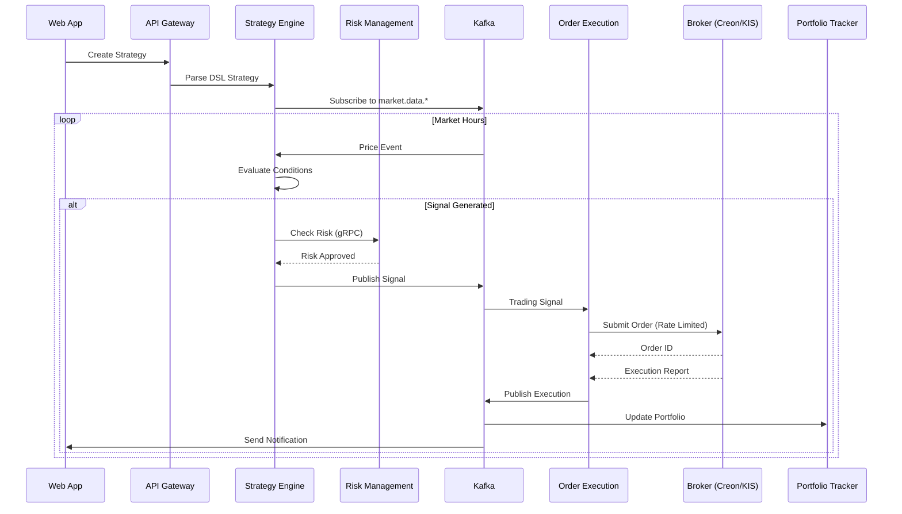

# JTS Integrated System Architecture

## Executive Summary

The JTS (JooHan Trading System) is a comprehensive automated trading platform built on a **layered microservices architecture** with **domain-driven design** principles. The system integrates multiple broker APIs, processes real-time market data, executes algorithmic trading strategies, and manages portfolios with sophisticated risk controls.

## Architecture Principles

### Core Design Principles
1. **Layered Architecture**: Strict hierarchy with unidirectional dependencies (upper → lower)
2. **Domain-Driven Design**: Bounded contexts for each business domain
3. **Event-Driven Architecture**: Asynchronous communication via Kafka for scalability
4. **Platform Isolation**: Windows dependencies isolated to specific services
5. **Rate Limit Management**: Built-in rate limiting for each broker integration
6. **Fault Tolerance**: Circuit breakers, retries, and graceful degradation

## System Architecture Layers

```
┌──────────────────────────────────────────────────────────────────┐
│                    PRESENTATION LAYER                            │
│         PWA Dashboard (React) + Mobile App (React Native)        │
│            Service Workers for Push Notifications                │
└──────────────────────────────────────────────────────────────────┘
                               ↓
┌──────────────────────────────────────────────────────────────────┐
│                      GATEWAY LAYER                               │
│     API Gateway (Kong/Express) - Auth, Rate Limiting, Routing    │
│                    WebSocket Gateway for Real-time               │
└──────────────────────────────────────────────────────────────────┘
                               ↓
┌──────────────────────────────────────────────────────────────────┐
│                    BUSINESS LAYER                                │
├────────────────┬────────────────┬────────────────┬───────────────┤
│Strategy Engine │Risk Management │Portfolio Tracker│Order Execution│
│ DSL Parser     │ Kelly Criterion│ P&L Calculation │ Order Router  │
│ Signal Gen     │ Drawdown Ctrl  │ Performance     │ Smart Router  │
└────────────────┴────────────────┴────────────────┴───────────────┘
                               ↓
┌──────────────────────────────────────────────────────────────────┐
│                   INTEGRATION LAYER                              │
├───────────────────────────────┬──────────────────────────────────┤
│  Market Data Collector        │    Notification Service          │
│  - Real-time ingestion        │    - PWA Push notifications      │
│  - Data normalization          │    - Email/SMS alerts            │
│  - Surge detection             │    - Trading signals              │
└───────────────────────────────┴──────────────────────────────────┘
                               ↓
┌──────────────────────────────────────────────────────────────────┐
│                    MESSAGING LAYER                               │
├───────────────────────────────┬──────────────────────────────────┤
│   Kafka Event Streaming       │      Redis Cache & Locks         │
│   - Market data events         │      - Price caching             │
│   - Trading signals            │      - Session management        │
│   - Order events               │      - Distributed locks         │
│   - System events              │      - Rate limit state          │
└───────────────────────────────┴──────────────────────────────────┘
                               ↓
┌──────────────────────────────────────────────────────────────────┐
│                     BROKERS LAYER                                │
├─────────────┬─────────────┬─────────────┬───────────────────────┤
│Creon Service│ KIS Service │Binance Serv.│   Upbit Service       │
│ Windows11   │   Linux     │   Linux     │     Linux             │
│ FastAPI     │   NestJS    │   NestJS    │     NestJS            │
│Rate: 15s/60 │Rate: 1s/20  │Rate: 1m/1200│   Rate: 1s/10         │
└─────────────┴─────────────┴─────────────┴───────────────────────┘
                               ↓
┌──────────────────────────────────────────────────────────────────┐
│                      DATA LAYER                                  │
├──────────────┬──────────────┬──────────────┬────────────────────┤
│ PostgreSQL   │ ClickHouse   │   MongoDB    │   File Storage     │
│ 800GB SSD    │ 2TB SSD      │  200GB SSD   │   NAS 16.4TB       │
│(Transactions)│(Time Series) │(Configuration)│  (Logs/Backups)   │
└──────────────┴──────────────┴──────────────┴────────────────────┘
```

## Detailed Workspace Structure

```
jts-trading-platform/
├── 📁 apps/                              # Application Services
│   ├── 📁 presentation/                  # UI Layer (Domain: User Interface)
│   │   ├── 📁 web-app/                   # React PWA with Service Workers
│   │   │   ├── src/
│   │   │   │   ├── components/          # Reusable UI components
│   │   │   │   ├── features/            # Feature modules
│   │   │   │   │   ├── dashboard/       # Trading dashboard
│   │   │   │   │   ├── strategies/      # Strategy management
│   │   │   │   │   ├── portfolio/       # Portfolio view
│   │   │   │   │   └── analytics/       # Performance analytics
│   │   │   │   ├── hooks/               # Custom React hooks
│   │   │   │   ├── services/            # API clients
│   │   │   │   └── workers/             # Service workers
│   │   │   └── project.json
│   │   └── 📁 mobile-app/                # React Native (optional)
│   │
│   ├── 📁 gateway/                       # API Gateway Layer (Domain: Routing)
│   │   └── 📁 api-gateway/               # Kong/Express gateway
│   │       ├── src/
│   │       │   ├── auth/                # JWT authentication
│   │       │   ├── middleware/          # Rate limiting, logging
│   │       │   ├── routes/              # API route definitions
│   │       │   └── websocket/           # WebSocket handlers
│   │       └── project.json
│   │
│   ├── 📁 business/                      # Business Logic Layer (Domain: Trading)
│   │   ├── 📁 strategy-engine/           # Domain: Strategy Execution
│   │   │   ├── src/
│   │   │   │   ├── dsl/                # DSL parser and compiler
│   │   │   │   ├── indicators/         # Technical indicators
│   │   │   │   ├── signals/            # Signal generation
│   │   │   │   ├── backtesting/        # Backtesting engine
│   │   │   │   └── optimization/       # Strategy optimization
│   │   │   └── project.json
│   │   │
│   │   ├── 📁 risk-management/           # Domain: Risk Control
│   │   │   ├── src/
│   │   │   │   ├── calculators/        # Kelly Criterion, VaR
│   │   │   │   ├── monitors/           # Real-time risk monitoring
│   │   │   │   ├── limits/             # Position limits, drawdown
│   │   │   │   └── alerts/             # Risk alert generation
│   │   │   └── project.json
│   │   │
│   │   ├── 📁 portfolio-tracker/         # Domain: Portfolio Management
│   │   │   ├── src/
│   │   │   │   ├── positions/          # Position tracking
│   │   │   │   ├── performance/        # P&L calculation
│   │   │   │   ├── analytics/          # Performance metrics
│   │   │   │   └── reporting/          # Report generation
│   │   │   └── project.json
│   │   │
│   │   └── 📁 order-execution/           # Domain: Order Management
│   │       ├── src/
│   │       │   ├── router/             # Smart order routing
│   │       │   ├── manager/            # Order lifecycle management
│   │       │   ├── executor/           # Execution algorithms
│   │       │   └── reconciliation/     # Trade reconciliation
│   │       └── project.json
│   │
│   ├── 📁 integration/                   # Integration Services (Domain: External Systems)
│   │   ├── 📁 market-data-collector/     # Domain: Market Data
│   │   │   ├── src/
│   │   │   │   ├── collectors/         # Data collection per broker
│   │   │   │   ├── normalizers/        # Data normalization
│   │   │   │   ├── surge/              # Surge detection algorithms
│   │   │   │   └── storage/            # Data persistence
│   │   │   └── project.json
│   │   │
│   │   └── 📁 notification-service/      # Domain: Notifications
│   │       ├── src/
│   │       │   ├── channels/           # PWA, email, SMS
│   │       │   ├── templates/          # Notification templates
│   │       │   └── scheduler/          # Notification scheduling
│   │       └── project.json
│   │
│   ├── 📁 brokers/                       # Broker Integration Layer (Domain: Exchange APIs)
│   │   ├── 📁 creon-service/             # Windows-only (Python FastAPI)
│   │   │   ├── src/
│   │   │   │   ├── main.py            # FastAPI application
│   │   │   │   ├── api/               # REST endpoints
│   │   │   │   ├── creon_client.py    # Creon COM wrapper
│   │   │   │   ├── rate_limiter.py    # Rate limit: 60req/15s
│   │   │   │   └── models/            # Request/response models
│   │   │   ├── Dockerfile.windows
│   │   │   └── requirements.txt
│   │   │
│   │   ├── 📁 kis-service/               # Linux (NestJS)
│   │   │   ├── src/
│   │   │   │   ├── api/               # KIS API client
│   │   │   │   ├── rate-limiter/      # Rate limit: 20req/s
│   │   │   │   └── account-pool/      # Multiple account management
│   │   │   └── project.json
│   │   │
│   │   ├── 📁 binance-service/           # Linux (NestJS)
│   │   │   ├── src/
│   │   │   │   ├── api/               # Binance API client
│   │   │   │   ├── websocket/         # Real-time streams
│   │   │   │   └── rate-limiter/      # Weight-based limiting
│   │   │   └── project.json
│   │   │
│   │   └── 📁 upbit-service/             # Linux (NestJS)
│   │       ├── src/
│   │       │   ├── api/               # Upbit API client
│   │       │   └── rate-limiter/      # Rate limit: 10req/s
│   │       └── project.json
│   │
│   └── 📁 platform/                      # Platform Services (Domain: Infrastructure)
│       ├── 📁 monitoring-service/        # Prometheus/Grafana integration
│       │   ├── src/
│       │   │   ├── metrics/           # Metrics collection
│       │   │   ├── alerts/            # Alert rules
│       │   │   └── dashboards/        # Grafana dashboards
│       │   └── project.json
│       │
│       └── 📁 configuration-service/     # Centralized configuration
│           ├── src/
│           │   ├── config-manager/    # Configuration management
│           │   └── feature-flags/     # Feature toggles
│           └── project.json
│
├── 📁 libs/                              # Shared Libraries
│   ├── 📁 shared/                        # Cross-cutting Concerns
│   │   ├── 📁 dto/                      # Data Transfer Objects
│   │   │   ├── src/
│   │   │   │   ├── market-data.dto.ts
│   │   │   │   ├── order.dto.ts
│   │   │   │   ├── portfolio.dto.ts
│   │   │   │   ├── strategy.dto.ts
│   │   │   │   └── risk.dto.ts
│   │   │   └── project.json
│   │   │
│   │   ├── 📁 interfaces/               # Shared Interfaces
│   │   │   ├── src/
│   │   │   │   ├── broker.interface.ts
│   │   │   │   ├── strategy.interface.ts
│   │   │   │   └── service.interface.ts
│   │   │   └── project.json
│   │   │
│   │   ├── 📁 types/                    # Type Definitions
│   │   ├── 📁 utils/                    # Utility Functions
│   │   ├── 📁 constants/                # System Constants
│   │   └── 📁 config/                   # Configuration Utilities
│   │
│   ├── 📁 domain/                        # Domain Models
│   │   ├── 📁 trading/                  # Trading Domain
│   │   │   ├── src/
│   │   │   │   ├── entities/          # Domain entities
│   │   │   │   ├── value-objects/     # Value objects
│   │   │   │   └── aggregates/        # Aggregates
│   │   │   └── project.json
│   │   ├── 📁 market-data/              # Market Data Domain
│   │   ├── 📁 portfolio/                # Portfolio Domain
│   │   ├── 📁 risk/                     # Risk Domain
│   │   └── 📁 strategy/                 # Strategy Domain
│   │
│   ├── 📁 infrastructure/                # Infrastructure Libraries
│   │   ├── 📁 database/                 # Database Utilities
│   │   │   ├── src/
│   │   │   │   ├── postgres/          # PostgreSQL client
│   │   │   │   ├── clickhouse/        # ClickHouse client
│   │   │   │   ├── mongodb/           # MongoDB client
│   │   │   │   └── migrations/        # Database migrations
│   │   │   └── project.json
│   │   │
│   │   ├── 📁 messaging/                # Messaging Infrastructure
│   │   │   ├── src/
│   │   │   │   ├── kafka/             # Kafka producer/consumer
│   │   │   │   ├── redis/             # Redis client & caching
│   │   │   │   ├── rate-limiter/      # Distributed rate limiting
│   │   │   │   └── event-bus/         # Event bus abstraction
│   │   │   └── project.json
│   │   │
│   │   ├── 📁 http/                     # HTTP Client Utilities
│   │   ├── 📁 logging/                  # Logging Infrastructure
│   │   └── 📁 monitoring/               # Monitoring Utilities
│   │
│   └── 📁 brokers/                       # Broker-specific Libraries
│       ├── 📁 creon/                    # Creon API Integration
│       ├── 📁 kis/                      # KIS API Integration
│       ├── 📁 binance/                  # Binance API Integration
│       └── 📁 upbit/                    # Upbit API Integration
│
├── 📁 infrastructure/                    # Infrastructure Configuration
│   ├── 📁 docker/                       # Docker Configurations
│   │   ├── 📁 linux/                   # Linux service containers
│   │   │   ├── docker-compose.yml
│   │   │   └── .env.linux
│   │   └── 📁 windows/                 # Windows Creon container
│   │       ├── docker-compose.windows.yml
│   │       └── .env.windows
│   │
│   ├── 📁 kubernetes/                   # K8s Manifests (Production)
│   │   ├── 📁 base/                   # Base configurations
│   │   ├── 📁 overlays/               # Environment overlays
│   │   └── kustomization.yaml
│   │
│   ├── 📁 terraform/                    # Infrastructure as Code
│   │   ├── 📁 modules/                # Terraform modules
│   │   └── main.tf
│   │
│   ├── 📁 databases/                    # Database Configurations
│   │   ├── 📁 postgres/               # PostgreSQL schemas
│   │   ├── 📁 clickhouse/             # ClickHouse schemas
│   │   ├── 📁 mongodb/                # MongoDB schemas
│   │   └── 📁 redis/                  # Redis configurations
│   │
│   ├── 📁 kafka/                        # Kafka Configuration
│   │   ├── topics.yaml                # Topic definitions
│   │   └── connectors/                # Kafka connectors
│   │
│   └── 📁 monitoring/                   # Monitoring Setup
│       ├── prometheus/                # Prometheus config
│       ├── grafana/                   # Grafana dashboards
│       └── alertmanager/              # Alert configurations
│
├── 📁 tools/                            # Development Tools
│   ├── 📁 generators/                  # Nx Custom Generators
│   │   ├── nestjs-service/           # Generate NestJS service
│   │   ├── react-feature/            # Generate React feature
│   │   └── domain-entity/            # Generate domain entity
│   ├── 📁 executors/                   # Nx Custom Executors
│   ├── 📁 scripts/                     # Build and utility scripts
│   └── 📁 workspace-plugin/            # Custom Nx plugins
│
├── 📁 docs/                             # Documentation
│   ├── 📁 architecture/               # Architecture documentation
│   ├── 📁 api/                        # API documentation
│   ├── 📁 deployment/                 # Deployment guides
│   └── 📁 development/                # Development guides
│
├── nx.json                              # Nx configuration
├── package.json                         # Root package.json
├── tsconfig.base.json                   # TypeScript base config
├── .eslintrc.json                       # ESLint configuration
├── jest.config.ts                       # Jest configuration
├── docker-compose.yml                   # Development docker-compose
└── README.md                            # Project documentation
```

## Service Communication Patterns

### Communication Protocols by Use Case

| Pattern | Protocol | Use Case | Example |
|---------|----------|----------|---------|
| **Request-Response** | HTTP/REST | External APIs, Simple queries | Web App → API Gateway |
| **RPC** | gRPC | Low-latency internal calls | Strategy Engine → Risk Management |
| **Event Streaming** | Kafka | Asynchronous events, Data distribution | Order Execution → Portfolio Tracker |
| **Pub/Sub** | Redis | Real-time updates, Cache invalidation | Price updates → All services |
| **WebSocket** | WS/WSS | Real-time bidirectional | Market data streaming |

### Service Communication Matrix



## Domain-Driven Design Implementation

### Bounded Contexts

1. **Trading Context**
   - Entities: Order, Trade, Position
   - Services: OrderExecutionService, TradingService
   - Aggregates: TradingSession

2. **Strategy Context**
   - Entities: Strategy, Signal, Indicator
   - Services: StrategyEngine, SignalGenerator
   - Value Objects: TradingRule, BacktestResult

3. **Risk Context**
   - Entities: RiskProfile, Limit, Alert
   - Services: RiskCalculator, LimitChecker
   - Value Objects: RiskMetric, DrawdownLimit

4. **Portfolio Context**
   - Entities: Portfolio, Holding, Performance
   - Services: PortfolioTracker, PerformanceCalculator
   - Aggregates: AccountPortfolio

5. **Market Data Context**
   - Entities: Quote, Candle, OrderBook
   - Services: DataCollector, DataNormalizer
   - Value Objects: Price, Volume

## Rate Limiter Architecture

### Per-Broker Rate Limiting Strategy

```typescript
interface RateLimitConfig {
  broker: string;
  limits: {
    requests: number;
    window: number;  // in milliseconds
    strategy: 'sliding' | 'fixed' | 'token-bucket';
  };
  priority: {
    high: string[];    // Order execution
    medium: string[];  // Real-time data
    low: string[];     // Historical data
  };
}

const rateLimitConfigs: RateLimitConfig[] = [
  {
    broker: 'creon',
    limits: { requests: 60, window: 15000, strategy: 'sliding' },
    priority: {
      high: ['submitOrder', 'cancelOrder'],
      medium: ['getRealtimePrice'],
      low: ['getHistoricalData']
    }
  },
  {
    broker: 'kis',
    limits: { requests: 20, window: 1000, strategy: 'token-bucket' },
    priority: {
      high: ['placeOrder', 'modifyOrder'],
      medium: ['getCurrentPrice'],
      low: ['getAccountInfo']
    }
  }
];
```

## Data Flow Examples

### Order Execution Flow



## Storage Architecture (LVM Configuration)

### 4TB NVMe SSD Partitioning

```bash
# Logical Volume Management Setup
lv_system: 200GB      # System, Docker, Applications
lv_postgres: 800GB    # Transactional data (ext4, noatime)
lv_clickhouse: 2000GB # Time-series data (ext4, noatime)
lv_kafka: 600GB       # Event streams (XFS, noatime, nobarrier)
lv_mongodb: 200GB     # Configuration data (ext4)
lv_redis: 50GB        # Cache data (ext4, noatime)
lv_backup: 150GB      # Local backups (ext4)
```

### Tiered Storage Strategy

```yaml
Hot Tier (NVMe SSD):
  - Real-time market data (< 7 days)
  - Active orders and positions
  - Redis cache
  - Kafka recent streams

Warm Tier (SATA SSD):
  - Recent historical data (7-90 days)
  - Completed trades
  - Performance metrics

Cold Tier (NAS):
  - Historical data (> 90 days)
  - Backtest results
  - System backups
  - Audit logs
```

## Kafka Topics Architecture

### Topic Organization

```yaml
# Market Data Domain
market-data.krx.ticks       # Real-time ticks (1d retention)
market-data.krx.candles     # OHLCV data (7d retention)
market-data.krx.orderbook   # Order book snapshots (1d retention)
market-data.crypto.*        # Crypto market data

# Trading Signal Domain
signals.entry.buy           # Buy signals (30d retention)
signals.entry.sell          # Sell signals (30d retention)
signals.exit.all           # Exit signals (30d retention)

# Order Management Domain
orders.pending             # Pending orders (1d retention)
orders.executions         # Executed orders (30d retention)
orders.failures           # Failed orders (7d retention)

# Portfolio Domain
portfolio.updates         # Portfolio changes (30d retention)
portfolio.performance     # Performance metrics (30d retention)

# Risk Domain
risk.alerts              # Risk warnings (7d retention)
risk.metrics            # Risk metrics (1d retention)
risk.limits             # Limit breaches (7d retention)

# System Domain
system.health           # Service health (3d retention)
system.errors          # System errors (7d retention)
system.metrics         # Performance metrics (1d retention)
```

## Deployment Architecture

### Multi-Platform Deployment

```yaml
Linux Server (Primary):
  Hardware:
    - CPU: Intel i7-13700K (16 cores)
    - RAM: 128GB DDR5
    - Storage: 1TB + 4TB NVMe
  Services:
    - All NestJS microservices
    - Kafka cluster
    - PostgreSQL, ClickHouse, MongoDB
    - Redis cluster
    - Monitoring stack

Windows Server (Creon):
  Hardware:
    - CPU: AMD Ryzen 5600
    - RAM: 32GB DDR4
    - Storage: 1TB NVMe
  Services:
    - Creon FastAPI service only
    - Rate limiter for Creon API

NAS (Backup):
  Model: Synology DS1821+
  Storage: 16.4TB available
  Purpose:
    - Historical data archive
    - Backup storage
    - Log aggregation
```

## Security Architecture

### Security Layers

1. **Network Security**
   - VPN for broker API access
   - TLS for all internal communication
   - Network segmentation

2. **Application Security**
   - JWT authentication
   - Role-based access control
   - API key rotation

3. **Data Security**
   - Encryption at rest
   - Encryption in transit
   - Data masking for sensitive info

4. **Trading Security**
   - Two-factor authentication for trades
   - Risk limit enforcement
   - Audit logging

## Performance Optimization

### Optimization Strategies

1. **Data Processing**
   - Batch processing for historical data
   - Stream processing for real-time data
   - Data compression (LZ4 for Kafka)

2. **Caching Strategy**
   - Redis for hot data
   - Application-level caching
   - CDN for static assets

3. **Database Optimization**
   - Proper indexing strategies
   - Partitioning for time-series data
   - Connection pooling

4. **Service Optimization**
   - Horizontal scaling for stateless services
   - Circuit breakers for fault tolerance
   - Bulkhead pattern for isolation

## Monitoring and Observability

### Monitoring Stack

```yaml
Metrics:
  - Prometheus: Metrics collection
  - Grafana: Visualization
  - AlertManager: Alert routing

Logging:
  - ELK Stack: Log aggregation
  - Structured logging with correlation IDs
  - Distributed tracing with Jaeger

Application Monitoring:
  - Health checks for all services
  - Performance metrics
  - Business metrics (trades, P&L)
```

## Development Workflow

### Git Workflow

```bash
main                # Production-ready code
├── develop         # Integration branch
├── feature/*       # Feature branches
├── hotfix/*        # Emergency fixes
└── release/*       # Release candidates
```

### CI/CD Pipeline

```yaml
Pipeline Stages:
  1. Code Quality:
     - Linting (ESLint)
     - Type checking (TypeScript)
     - Unit tests (Jest)
  
  2. Build:
     - Nx affected builds
     - Docker image creation
     - Artifact storage
  
  3. Test:
     - Integration tests
     - E2E tests
     - Performance tests
  
  4. Deploy:
     - Staging deployment
     - Smoke tests
     - Production deployment
     - Health verification
```

## Conclusion

This integrated architecture provides:

1. **Scalability**: Microservices can scale independently
2. **Resilience**: Fault isolation and circuit breakers
3. **Performance**: Optimized for high-frequency trading
4. **Maintainability**: Clear domain boundaries and DDD
5. **Flexibility**: Support for multiple brokers and strategies
6. **Observability**: Comprehensive monitoring and logging

The architecture is designed to handle the complexities of automated trading while maintaining clean separation of concerns and allowing for future expansion.