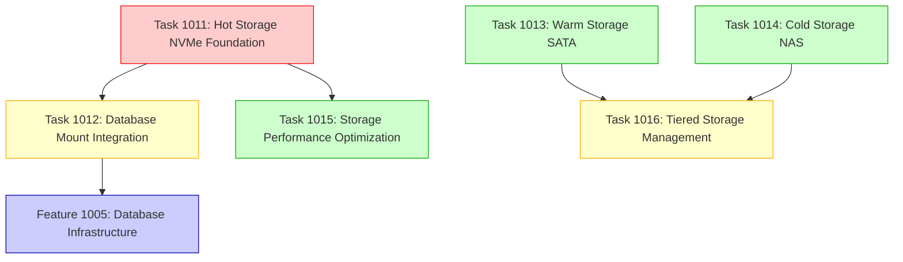

# JTS Storage Infrastructure Implementation Coordination Guide

## Overview

This document provides implementation coordination for the six-task decomposition of JTS storage infrastructure, enabling parallel execution and proper dependency management to reduce implementation time from 24+ hours to approximately 16 hours.

## Task Dependencies and Execution Strategy

### Dependency Chain Analysis



### Implementation Phases

#### Phase 1: Foundation (Sequential - Week 1)
**Duration: 8 hours**

- **Task 1011**: Hot Storage (NVMe) Foundation ⚠️ **HIGH RISK**
  - **Priority**: Must complete first
  - **Risk**: Disk partitioning operations
  - **Blocks**: Tasks 1012, 1015
  - **Validation**: LVM verification, filesystem integrity
  - **Rollback**: Complete LVM removal procedure documented

#### Phase 2: Parallel Implementation (Week 2)  
**Duration: 6 hours (3h + 3h in parallel)**

- **Task 1013**: Warm Storage (SATA) Setup 🔄 **PARALLEL SAFE**
  - **Independent**: No dependencies on other storage tasks
  - **Risk**: Low - secondary storage
  - **Can run with**: Task 1014

- **Task 1014**: Cold Storage (NAS) Integration 🔄 **PARALLEL SAFE**
  - **Independent**: No dependencies on other storage tasks  
  - **Risk**: Low - network storage
  - **Can run with**: Task 1013

#### Phase 3: Integration (Sequential - Week 3)
**Duration: 6 hours (4h + 2h)**

- **Task 1012**: Database Mount Integration
  - **Depends on**: Task 1011 (requires LVM infrastructure)
  - **Enables**: Feature 1005 (Database Infrastructure)
  - **Critical**: Service-specific permissions and mount points

- **Task 1015**: Storage Performance Optimization  
  - **Depends on**: Task 1011 (requires NVMe infrastructure)
  - **Risk**: Low - reversible optimizations

#### Phase 4: Management (Final - Week 4)
**Duration: 4 hours**

- **Task 1016**: Tiered Storage Management
  - **Depends on**: Tasks 1013, 1014 (requires all storage tiers)
  - **Scope**: Automation and lifecycle management

## Parallel Execution Implementation

### Week 2 Parallel Strategy

**Recommended Approach**: Assign different team members or use isolated environments for parallel tasks.

```bash
# Terminal 1: Warm Storage SATA Setup (Task 1013)
cd /home/joohan/dev/project-jts/jts
git checkout -b task/1013-warm-storage-sata
# Execute Task 1013 implementation

# Terminal 2: Cold Storage NAS Integration (Task 1014)  
cd /home/joohan/dev/project-jts/jts
git checkout -b task/1014-cold-storage-nas
# Execute Task 1014 implementation
```

**Safety Measures**:
- Tasks 1013 and 1014 operate on completely different storage devices
- No shared filesystem operations
- No conflicting mount points
- Independent of LVM infrastructure

### Cross-Task Integration Points

#### Shared Configuration Files

**`/etc/fstab` Management**:
- **Task 1011**: Creates NVMe LVM mount entries
- **Task 1012**: Adds database-specific mount options
- **Task 1013**: Adds SATA btrfs mount entry
- **Task 1014**: Adds NFS mount entry

**Coordination Strategy**:
```bash
# Each task appends to fstab with clear section markers
echo "# Task 1011: Hot Storage NVMe Mounts" >> /etc/fstab
echo "# Task 1013: Warm Storage SATA Mount" >> /etc/fstab  
echo "# Task 1014: Cold Storage NAS Mount" >> /etc/fstab
```

#### Directory Structure Dependencies

**Mount Point Creation Order**:
1. **Task 1011**: Creates base LVM logical volumes
2. **Task 1012**: Creates service-specific mount directories
3. **Task 1013**: Creates warm storage directories
4. **Task 1014**: Creates NAS directory structure

## Implementation Validation and Testing

### Per-Task Validation

#### Task 1011 Validation (Critical)
```bash
# Verify LVM structure
vgdisplay vg_jts
lvdisplay vg_jts

# Test filesystem integrity
for lv in lv_postgres lv_clickhouse lv_kafka lv_mongodb lv_redis lv_docker lv_local_backup; do
    echo "Testing /dev/vg_jts/$lv"
    fsck -n /dev/vg_jts/$lv
done

# Performance verification
fio --name=nvme_test --ioengine=libaio --rw=randread --bs=4k --numjobs=4 --runtime=60 --filename=/var/lib/postgresql/test
```

#### Task 1012 Validation
```bash
# Verify mount points and permissions
ls -la /var/lib/{postgresql,clickhouse,kafka,mongodb,redis,docker-jts}
df -h | grep vg_jts

# Test service user access
sudo -u postgres touch /var/lib/postgresql/write_test
sudo -u clickhouse touch /var/lib/clickhouse/write_test
```

#### Tasks 1013 & 1014 Validation
```bash
# SATA btrfs verification
btrfs filesystem show /data/warm-storage
df -h /data/warm-storage

# NAS connectivity and performance
time dd if=/dev/zero of=/mnt/synology/jts/test_file bs=1M count=100
rm /mnt/synology/jts/test_file
```

### Integration Testing

#### Cross-Task Dependencies
```bash
# Verify all storage tiers are accessible
df -h | grep -E "(vg_jts|warm-storage|synology)"

# Test tiered data flow
echo "test data" > /var/lib/postgresql/hot_test
cp /var/lib/postgresql/hot_test /data/warm-storage/warm_test  
cp /data/warm-storage/warm_test /mnt/synology/jts/cold_test

# Verify file integrity across tiers
sha256sum /var/lib/postgresql/hot_test /data/warm-storage/warm_test /mnt/synology/jts/cold_test
```

## Risk Management and Rollback Procedures

### High-Risk Operations (Task 1011)

**Pre-Implementation Safety**:
```bash
# Complete system backup
rsync -av --exclude=/proc --exclude=/sys --exclude=/dev / /backup/system_backup/

# Document current partition table
fdisk -l > /backup/partition_backup.txt
cp /etc/fstab /backup/fstab.backup
```

**Rollback Procedure for Task 1011**:
```bash
# Emergency LVM rollback
umount /var/lib/{postgresql,clickhouse,kafka,mongodb,redis,docker-jts}
lvremove vg_jts/lv_*
vgremove vg_jts  
pvremove /dev/nvme0n1

# Restore original fstab
cp /backup/fstab.backup /etc/fstab
```

### Low-Risk Task Rollback

**Task 1013 (SATA) Rollback**:
```bash
umount /data/warm-storage
# Remove fstab entry for SATA mount
sed -i '/warm-storage/d' /etc/fstab
```

**Task 1014 (NAS) Rollback**:
```bash
umount /mnt/synology
# Remove fstab entry for NFS mount
sed -i '/synology/d' /etc/fstab
```

## Performance Optimization Coordination

### Tier-Specific Optimizations

**Hot Tier (Task 1011 + 1015)**:
- SSD I/O scheduler optimization
- TRIM support configuration
- LVM stripe optimization
- Database-specific filesystem tuning

**Warm Tier (Task 1013)**:
- Btrfs compression settings
- Autodefrag configuration
- Backup-optimized I/O patterns

**Cold Tier (Task 1014)**:
- NFS buffer optimization
- Network transfer settings
- Bulk operation efficiency

### Cross-Tier Performance Monitoring

```bash
# Monitor all storage tiers simultaneously
iostat -x 1 | grep -E "(nvme0n1|sda|nfs)"

# Check mount options across all tiers
mount | grep -E "(vg_jts|warm-storage|synology)"

# Verify TRIM functionality
fstrim -av
```

## Documentation and Handoff Procedures

### Implementation Documentation

Each task implementation should produce:

1. **Setup Scripts**: Automated setup procedures
2. **Validation Reports**: Performance and integrity verification
3. **Configuration Files**: All modified system configurations
4. **Troubleshooting Guides**: Common issues and solutions
5. **Monitoring Procedures**: Ongoing maintenance and health checks

### Operational Handoff

**Complete Storage Infrastructure Documentation**:
- Unified storage architecture diagram
- Cross-tier data flow documentation  
- Emergency procedures for each tier
- Performance baseline measurements
- Capacity planning guidelines

### Final Integration Validation

```bash
# Execute comprehensive storage test suite
./scripts/storage-health.sh
./scripts/performance-test.sh
./scripts/tiered-storage.sh check

# Verify all dependent services can start
systemctl start postgresql clickhouse kafka mongodb redis
```

## Timeline and Resource Allocation

### Optimized 16-Hour Implementation Schedule

```
Week 1 (8 hours):
├── Task 1011: Hot Storage Foundation [HIGH RISK]
└── Complete validation and documentation

Week 2 (6 hours parallel):
├── Task 1013: Warm Storage ──── Developer A (3h)
└── Task 1014: Cold Storage ──── Developer B (3h)

Week 3 (6 hours sequential):
├── Task 1012: Database Integration (4h)
└── Task 1015: Performance Optimization (2h)

Week 4 (4 hours):
└── Task 1016: Management Automation
```

**Resource Requirements**:
- 1-2 senior developers
- System administration access
- Test environment for validation
- Backup and recovery capabilities

## Success Criteria

### Implementation Success Metrics

- [ ] All six tasks completed without system failures
- [ ] Cross-task integration validated
- [ ] Performance benchmarks met or exceeded
- [ ] All dependent features unblocked (Feature 1005)
- [ ] Comprehensive documentation delivered
- [ ] Emergency rollback procedures tested
- [ ] Monitoring and alerting operational

### Performance Targets

- **Hot Tier**: >50,000 IOPS random read
- **Warm Tier**: >200 MB/s sequential write  
- **Cold Tier**: >100 MB/s network throughput
- **Cross-Tier**: <5 second data migration between tiers

This coordination guide enables safe, efficient, and properly managed implementation of the complete JTS storage infrastructure with minimized risk and maximized parallel execution opportunities.