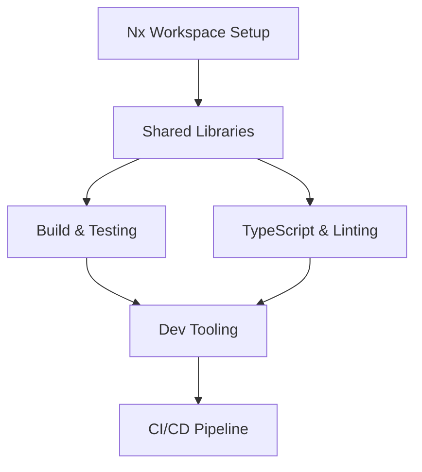

# Context: Monorepo Structure and Tooling (F03)

**Spec**: [Monorepo Structure and Tooling](F03.spec.md)  
**Status**: draft
**Created**: 2025-08-28  
**Updated**: 2025-08-28

## Summary

Feature specification for establishing a comprehensive monorepo structure using Nx workspace to manage all JTS microservices, shared libraries, and applications. Split into 6 implementation tasks covering Nx initialization, shared libraries, build/testing, TypeScript/linting, development tooling, and CI/CD pipeline.

## Implementation Timeline

### Session 1: 2025-08-28 - Task Breakdown
**Action**: Split feature into tasks  
**Method**: Software architect analysis  
**Duration**: 30 minutes

**Created Specs**:
- [Task T01: Initialize Nx Workspace with Base Configuration](T01.md) - 2 hours
- [Task T02: Configure Shared Libraries Infrastructure](T02.md) - 3 hours
- [Task T03: Set Up Build and Testing Infrastructure](T03.md) - 2.5 hours
- [Task T04: Implement TypeScript Configuration and Linting](T04.md) - 2 hours
- [Task T05: Create Development Tooling and Generators](T05.md) - 2.5 hours
- [Task T06: Configure CI/CD Pipeline and Automation](T06.md) - 2 hours

**Rationale**:
- Each task represents a logical, self-contained component
- Tasks build upon each other with clear dependencies
- Total estimated time: 14 hours
- Parallel execution possible for tasks 3 & 4 after task 2

**Key Decisions**:
1. Nx 17+ for advanced monorepo capabilities
2. Strict TypeScript configuration for type safety
3. Jest with 95% coverage threshold for quality assurance
4. Custom generators for consistent service creation
5. GitHub Actions with affected builds for efficiency

## Architecture Discussion (2025-08-28)

### Questions Reviewed from Spec F03 (Monorepo Structure)

**Q1: Why do `brokers` and `domain` exist in `libs/`?**

**Answer**: This is correct according to Nx monorepo architecture with DDD:

- `libs/brokers/`: Contains broker integration libraries (Creon, KIS, Binance, Upbit) as shared libraries that can be imported by multiple services
- `libs/domain/`: Contains business domain logic following DDD principles - centralized and reusable across services

This separation follows the dependency rule: apps can depend on libs, but not vice versa.

**Q2: Market Data Collector and Notification Service placement inconsistency**

**Issue Identified**: In the System Architecture Layers diagram, these services are shown in the Integration Layer, but in the Workspace Structure, they're in `apps/`.

**Resolution**:

- These should be standalone microservices in `apps/` (current workspace structure is correct)
- The architecture diagram should be updated to show them in the Business Layer
- They use integration libraries from `libs/brokers/` but are themselves business services

**Q3: No `src/` directory at project root**

**Answer**: This is standard for Nx monorepo structure:

- Each app and lib has its own `src/` directory internally
- Root level contains only workspace-wide configuration
- Documentation folders (`specs/`, `context/`) can optionally be moved to `docs/` for better organization

### Action Items

- ✅ Document architecture clarifications
- ✅ Update spec F03 to fix architecture layer diagram

## Task Dependencies

## Implementation Order

1. **Task T01** - Foundation (must be first)
2. **Task T02** - Shared libraries infrastructure
3. **Tasks T03 & T04** - Can run in parallel
   - T03: Build and testing setup
   - T04: TypeScript and linting configuration
4. **Task T05** - Development tooling and generators
5. **Task T06** - CI/CD pipeline (final integration)

## Risk Mitigation

- **Nx Version Compatibility**: Lock to Nx 17.2.8 for stability
- **Module Boundaries**: Enforce strict dependency rules from the start
- **Performance**: Configure caching and parallel execution early
- **Developer Experience**: Prioritize automation and clear documentation
- **Cross-Platform Support**: Test on both Linux and Windows environments

## Success Metrics

- [ ] Complete monorepo setup in under 30 minutes on fresh system
- [ ] All shared libraries properly configured with path mappings
- [ ] Build times optimized with Nx caching
- [ ] 95% test coverage threshold enforced
- [ ] CI/CD pipeline runs affected builds in under 5 minutes
- [ ] Custom generators reduce boilerplate by 80%

## Notes

- Focus on scalability for future microservice additions
- Maintain strict architectural boundaries between layers
- Optimize for developer productivity with automation
- Consider Nx Cloud for distributed builds in production
- Follow Domain-Driven Design principles throughout
