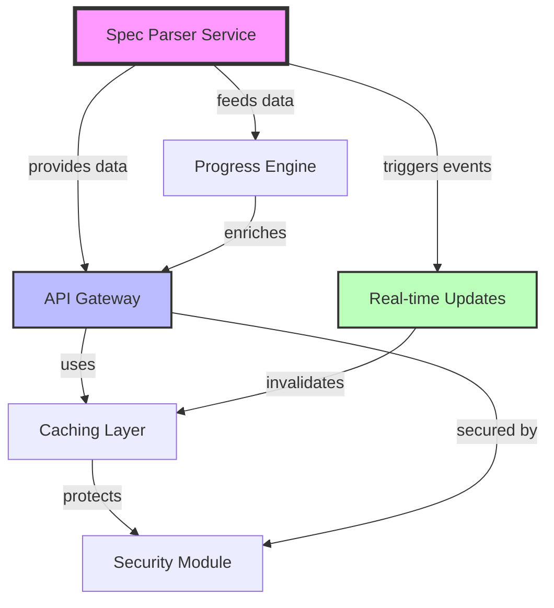

# E13: Status API for Spec Dashboard

## Spec Information

- **Spec ID**: E13
- **Title**: Status API for Spec Dashboard
- **Type**: Epic
- **Status**: Draft
- **Priority**: High
- **Created**: 2025-09-04
- **Updated**: 2025-09-04

## Description

Implement a comprehensive API service in the JTS project to expose spec data for consumption by the JTS Spec Dashboard. This API will parse spec files, calculate progress, and provide real-time updates while maintaining clean architectural boundaries between the JTS core system and visualization tools.

## Business Context

The JTS Spec Dashboard (external project) needs to consume spec data from JTS without direct filesystem access. By implementing a proper API layer, we enable:

- Multiple dashboard instances or other consumers
- Clean separation of concerns between spec management and visualization
- Centralized spec parsing logic in JTS
- Real-time collaboration features
- Enhanced security through controlled data access

## Scope

### In Scope

- RESTful API endpoints for spec data retrieval
- WebSocket/SSE support for real-time updates
- YAML frontmatter parsing and processing
- Hierarchical spec relationship building
- Progress calculation and statistics
- Multi-level caching strategy
- Security and rate limiting

### Out of Scope

- Dashboard UI implementation (handled by spec dashboard project)
- Spec file modification endpoints (read-only API)
- User authentication (phase 2 consideration)
- Historical spec version tracking

## Acceptance Criteria

- [ ] API endpoints respond within 200ms for cached data
- [ ] Real-time updates delivered within 1 second of file changes
- [ ] Support for 1000+ spec files without performance degradation
- [ ] Graceful handling of malformed spec files
- [ ] 100% uptime during spec file operations
- [ ] Comprehensive API documentation generated
- [ ] All endpoints covered by integration tests

## Features

### F01: Spec Parser Service

**Priority**: Critical (Foundation)
**Status**: Draft

Foundation service for parsing and processing .spec.md files with YAML frontmatter extraction, hierarchical relationship building, and in-memory registry management.

**Key Deliverables**:

- Spec file discovery and indexing
- YAML frontmatter parser with gray-matter
- Hierarchical ID resolver
- In-memory spec registry
- Error recovery for malformed files

---

### F02: Spec API Gateway

**Priority**: Critical
**Status**: Draft
**Dependencies**: F01

RESTful API endpoints providing comprehensive spec data access with support for multiple response formats.

**Core Endpoints**:

- `GET /api/specs` - List all specs with metadata
- `GET /api/specs/:id` - Individual spec details
- `GET /api/specs/tree` - Hierarchical tree structure
- `GET /api/specs/stats` - Statistics and progress

**Key Deliverables**:

- NestJS controllers with OpenAPI documentation
- Response DTOs with validation
- Raw markdown and HTML rendering support
- Pagination for large datasets

---

### F03: Real-time Updates Engine

**Priority**: High
**Status**: Draft
**Dependencies**: F01

WebSocket/SSE implementation for live spec change notifications and real-time collaboration support.

**Key Deliverables**:

- File system watcher using chokidar
- WebSocket server with Socket.IO
- Event broadcasting system
- Connection management and cleanup
- Subscription-based filtering

---

### F04: Caching & Performance Layer

**Priority**: High
**Status**: Draft
**Dependencies**: F01, F02

Redis-based caching strategy with multi-level optimization for sub-200ms response times.

**Key Deliverables**:

- Redis integration for persistent cache
- In-memory LRU cache for hot data
- Cache invalidation on file changes
- Lazy HTML rendering
- Query result caching

---

### F05: Progress Calculation Engine

**Priority**: Medium
**Status**: Draft
**Dependencies**: F01

Automated progress tracking with statistical analysis and dependency-aware calculations.

**Key Deliverables**:

- Status-based completion calculation
- Epic/Feature/Task aggregation
- Dependency chain analysis
- Performance metrics generation
- Trend analysis for velocity

---

### F06: Security & Resilience Module

**Priority**: Medium
**Status**: Draft
**Dependencies**: F02, F03

Production-ready security hardening with comprehensive error handling and resilience patterns.

**Key Deliverables**:

- Rate limiting with @nestjs/throttler
- Request validation and sanitization
- Circuit breaker for file operations
- Graceful degradation strategies
- Security headers and CORS configuration

## Technical Architecture

### Service Structure

```
apps/
  spec-api/
    src/
      modules/
        parser/         # F01: Core parsing logic
        api/           # F02: REST controllers
        realtime/      # F03: WebSocket handlers
        cache/         # F04: Caching services
        analytics/     # F05: Progress calculations
        security/      # F06: Security middleware
```

### Technology Stack

- **Framework**: NestJS with Express
- **Parsing**: gray-matter, remark
- **Cache**: Redis + node-redis
- **WebSocket**: Socket.IO
- **Monitoring**: chokidar
- **Validation**: class-validator

## Dependencies Between Features



### Dependency Analysis

**Critical Path**: F01 → F02 → F04

- F01 must be completed first as the foundation
- F02 can begin once F01 has basic functionality
- F04 can be developed in parallel after F01

**Parallel Development Opportunities**:

- F03 and F04 can be developed simultaneously after F01
- F05 can start once F01 data structures are defined
- F06 should be integrated incrementally throughout

**Integration Points**:

- F01 provides the data model for all other features
- F04 sits between data providers (F01, F05) and consumers (F02, F03)
- F06 wraps all external-facing features (F02, F03)

## Implementation Phases

### Phase 1: MVP (Weeks 1-2)

**Goal**: Basic working API for dashboard development

**Deliverables**:

- F01: Basic parser with frontmatter extraction
- F02: Core endpoints (/specs, /specs/:id)
- Simple file-based operation
- Manual testing setup

**Success Metrics**:

- Dashboard can retrieve spec list
- Individual specs are accessible
- < 500ms response time

---

### Phase 2: Enhanced API (Weeks 3-4)

**Goal**: Complete API with performance optimization

**Deliverables**:

- F02: All REST endpoints complete
- F04: Redis caching implementation
- F05: Progress calculations
- F06: Basic security (rate limiting)
- Integration test suite

**Success Metrics**:

- < 200ms cached response time
- Statistics endpoint functional
- 90% test coverage

---

### Phase 3: Production Ready (Weeks 5-6)

**Goal**: Real-time updates and production hardening

**Deliverables**:

- F03: WebSocket implementation
- F04: Advanced caching strategies
- F06: Complete security hardening
- Performance monitoring
- API documentation

**Success Metrics**:

- < 1s real-time update latency
- 100+ concurrent WebSocket connections
- 99.9% uptime

## Risk Analysis

### Technical Risks

| Risk                                                | Impact | Probability | Mitigation                                        |
| --------------------------------------------------- | ------ | ----------- | ------------------------------------------------- |
| File system performance with large spec directories | High   | Medium      | Implement incremental parsing, aggressive caching |
| Memory consumption with full spec loading           | High   | Low         | Use pagination, LRU eviction, streaming           |
| Race conditions during concurrent updates           | Medium | Medium      | File locking, event queuing, atomic operations    |
| WebSocket connection management at scale            | Medium | Low         | Connection pooling, room-based broadcasting       |
| YAML parsing errors breaking service                | Low    | High        | Comprehensive error handling, validation          |

### Architectural Risks

| Risk                                     | Impact | Mitigation                                 |
| ---------------------------------------- | ------ | ------------------------------------------ |
| Tight coupling between parser and API    | Medium | Use dependency injection, clear interfaces |
| Cache invalidation complexity            | Low    | Event-driven invalidation, versioning      |
| API contract changes affecting dashboard | High   | Versioned API, deprecation strategy        |

## Success Metrics

- **Performance**: < 200ms API response time (cached)
- **Scalability**: Support 1000+ spec files
- **Reliability**: 99.9% uptime
- **Real-time**: < 1s update propagation
- **Quality**: 90% test coverage
- **Documentation**: 100% API documentation coverage

## Architecture Decision Records

### ADR-001: API-First Architecture

**Decision**: Implement spec data access through APIs only
**Rationale**: Clean separation, multiple consumers, security
**Alternatives**: Direct file access, shared database
**Trade-offs**: Added complexity vs flexibility

### ADR-002: Redis for Caching

**Decision**: Use Redis as primary cache layer
**Rationale**: Proven performance, existing infrastructure
**Alternatives**: In-memory only, database caching
**Trade-offs**: Infrastructure dependency vs performance

### ADR-003: WebSocket for Real-time

**Decision**: Socket.IO for real-time updates
**Rationale**: Wide browser support, reconnection handling
**Alternatives**: SSE, long polling, WebRTC
**Trade-offs**: Complexity vs functionality

## Context and Discussion

This epic originates from a request by the JTS Spec Dashboard project, which needs to consume spec data without direct filesystem access. The architectural discussion concluded that:

1. **Parsing Ownership**: JTS should own spec parsing logic as the single source of truth
2. **Clean Boundaries**: Dashboard should be a pure data consumer
3. **Phased Approach**: MVP with Docker volumes → API-based → CDN for production
4. **Flexibility**: API enables multiple consumers beyond just the dashboard

The implementation should prioritize developer experience with clear APIs while maintaining performance and security standards suitable for production deployment.

## References

- [Original Dashboard Request](../E13/E13.context.md)
- [JTS Architecture Documentation](../../docs/architecture/README.md)
- [NestJS Best Practices](https://docs.nestjs.com/techniques)
- [Redis Caching Strategies](https://redis.io/docs/manual/patterns/)
