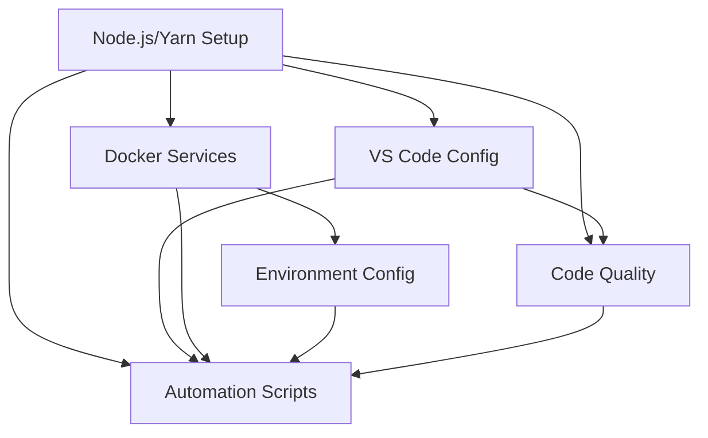

# Context: Development Environment Setup (F02)

**Spec**: [Development Environment Setup](spec.md)
**Status**: draft
**Created**: 2025-08-27
**Updated**: 2025-08-27

## Summary

Feature specification for establishing a standardized development environment for the JTS automated trading system. Split into 6 implementation tasks covering Node.js/Yarn setup, VS Code configuration, Docker services, environment management, code quality tools, and automation scripts.

## Implementation Timeline

### Session 1: 2025-08-27 - Task Breakdown
**Action**: Split feature into tasks
**Method**: Software architect analysis
**Duration**: 30 minutes

**Created Specs**:
- [Task T01: Node.js and Yarn Environment Setup](T01.md) - 2 hours
- [Task T02: VS Code IDE Configuration](T02.md) - 2 hours
- [Task T03: Docker and Database Services Setup](T03.md) - 3 hours
- [Task T04: Environment Configuration and Secrets Management](T04.md) - 2 hours
- [Task T05: Code Quality Tools and Git Hooks](T05.md) - 2 hours
- [Task T06: Development Scripts and Automation](T06.md) - 3 hours

**Rationale**: 
- Each task represents a logical, self-contained component
- Tasks have clear dependencies (T01 must be done first)
- Total estimated time: 14 hours
- Tasks can be implemented incrementally

**Key Decisions**:
1. Yarn over npm for better monorepo support
2. VS Code only (removed WebStorm) for consistency
3. Two-file environment strategy (.env.example + .env.local)
4. Docker Compose for all local services
5. Comprehensive automation to reduce setup friction

## Task Dependencies

## Implementation Order

1. **Task T01** - Foundation (must be first)
2. **Task T03** - Docker services (can run in parallel with T02)
3. **Task T02** - VS Code setup
4. **Task T04** - Environment configuration
5. **Task T05** - Code quality tools
6. **Task T06** - Final automation and documentation

## Risk Mitigation

- **Platform Differences**: Separate scripts for Linux and Windows
- **Credential Security**: Never store secrets in plain text
- **Service Dependencies**: Health checks before proceeding
- **Developer Experience**: Comprehensive automation and clear documentation

## Success Metrics

- [ ] Complete setup in under 30 minutes on fresh system
- [ ] All services start successfully
- [ ] Development workflow fully automated
- [ ] No manual configuration required
- [ ] Clear troubleshooting documentation

## Notes

- Focus on developer productivity and minimal friction
- Support for multi-account trading architecture
- Security-first approach for credentials
- Scalable from development to production